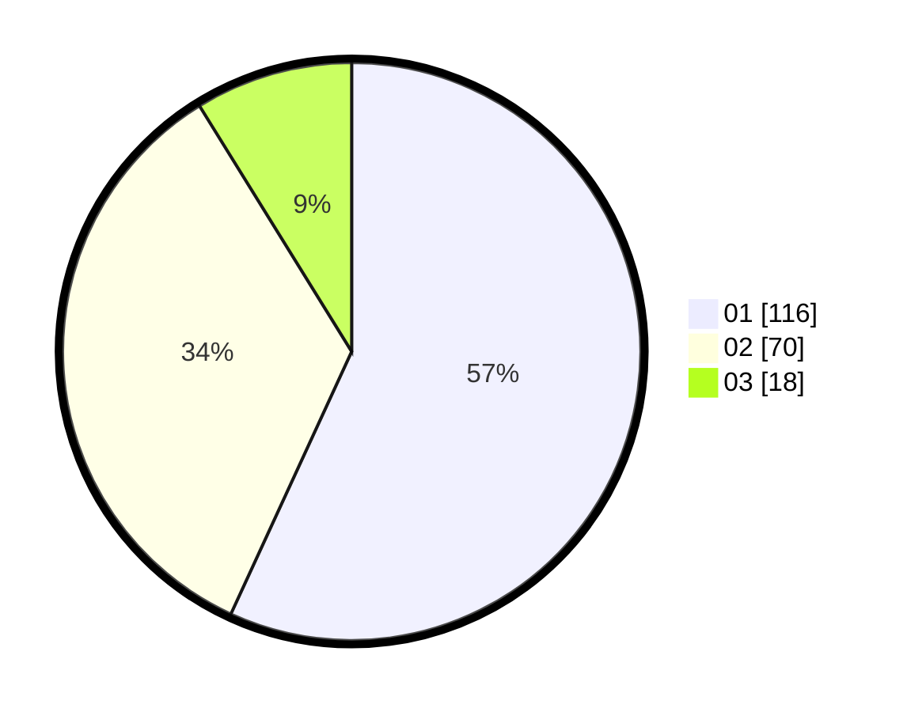

# Hasil

Hasil perolehan suara paslon dapat dilihat pada file paslon-01.txt, paslon-02.txt, dan paslon-03.txt.

Jika tidak ada, artinya data tersebut belum ada pada SIREKAP.

## Perolehan Suara

 * Paslon 01: **116**.
 * Paslon 02: **70**.
 * Paslon 03: **18**.

## Foto C Plano

https://sirekap-obj-formc.kpu.go.id/d9d9/pemilu/ppwp/31/75/04/10/05/3175041005037-20240215-003714--b9fd228f-4927-4b9f-9d08-13540c518fe2.jpg

https://sirekap-obj-formc.kpu.go.id/d9d9/pemilu/ppwp/31/75/04/10/05/3175041005037-20240215-003755--4d7c96aa-14bb-4cca-8ad5-a4266d0c76e3.jpg

https://sirekap-obj-formc.kpu.go.id/d9d9/pemilu/ppwp/31/75/04/10/05/3175041005037-20240215-003843--cc0f4df1-98b1-408c-bc84-628d114a987d.jpg
