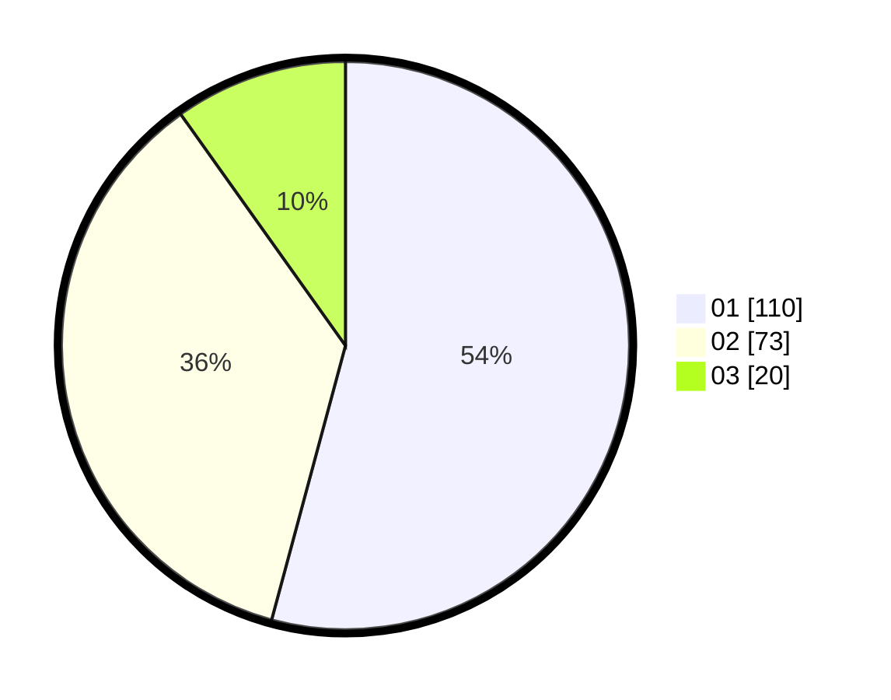

# Hasil

Hasil perolehan suara paslon dapat dilihat pada file paslon-01.txt, paslon-02.txt, dan paslon-03.txt.

Jika tidak ada, artinya data tersebut belum ada pada SIREKAP.

## Perolehan Suara

 * Paslon 01: **110**.
 * Paslon 02: **73**.
 * Paslon 03: **20**.

## Foto C Plano

https://sirekap-obj-formc.kpu.go.id/4673/pemilu/ppwp/31/75/04/10/05/3175041005039-20240216-165043--289a43a0-01f2-44c2-9226-34f4aec112f1.jpg

https://sirekap-obj-formc.kpu.go.id/4673/pemilu/ppwp/31/75/04/10/05/3175041005039-20240216-164739--73b0090c-e284-44a6-9b67-a2123224f538.jpg

https://sirekap-obj-formc.kpu.go.id/4673/pemilu/ppwp/31/75/04/10/05/3175041005039-20240216-165044--32edcdd1-e779-4439-b959-ba3d649f2947.jpg

## DATA PEMILIH TETAP

Jumlah pemilih dalam DPT: **277**.
 * L: **138**.
 * P: **139**.

## DATA PENGGUNA HAK PILIH

Jumlah pengguna hak pilih dalam DPT: **205**.
 * L: **105**.
 * P: **100**.

Jumlah pengguna hak pilih dalam DPTb: **0**.
 * L: **0**.
 * P: **0**.

Jumlah pengguna hak pilih dalam DPK: **0**.
 * L: **0**.
 * P: **0**.

Jumlah pengguna hak pilih: **205**.
 * L: **105**.
 * P: **100**.

## JUMLAH SUARA SAH DAN TIDAK SAH

JUMLAH SELURUH SUARA SAH: **203**.

JUMLAH SUARA TIDAK SAH: **2**.

JUMLAH SELURUH SUARA SAH DAN SUARA TIDAK SAH: **205**.
