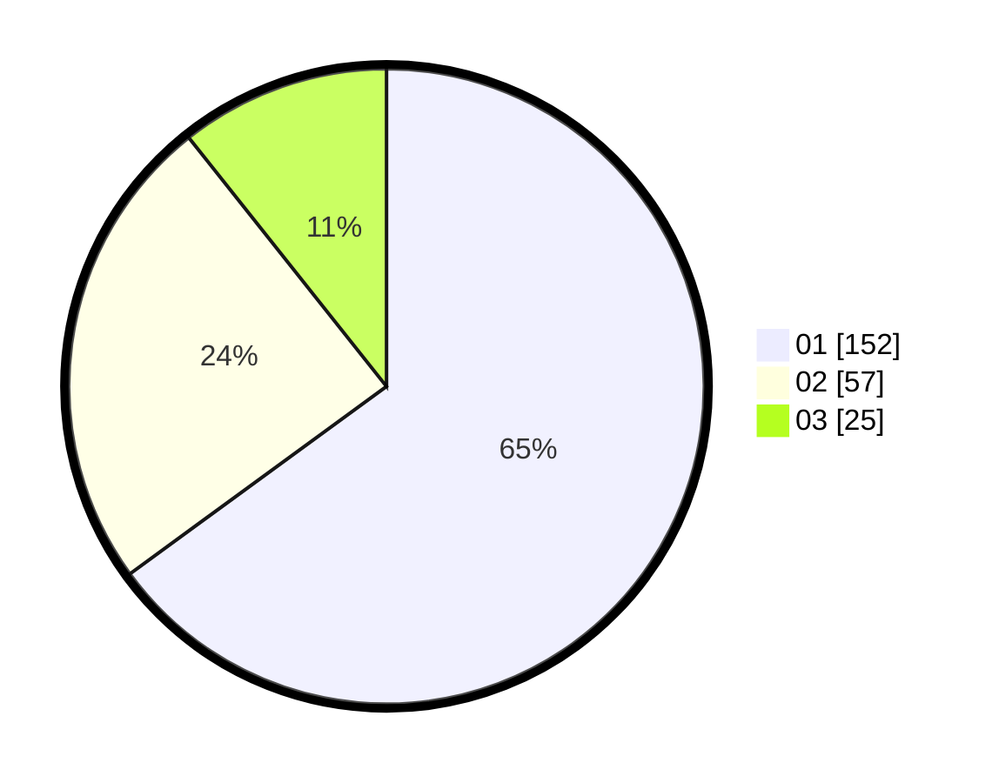

# Hasil

Hasil perolehan suara paslon dapat dilihat pada file paslon-01.txt, paslon-02.txt, dan paslon-03.txt.

Jika tidak ada, artinya data tersebut belum ada pada SIREKAP.

## Perolehan Suara

 * Paslon 01: **152**.
 * Paslon 02: **57**.
 * Paslon 03: **25**.

## Foto C Plano

https://sirekap-obj-formc.kpu.go.id/23e7/pemilu/ppwp/31/75/04/10/05/3175041005040-20240215-015205--cc09b466-2157-496f-981f-b20eb10e7cd9.jpg

https://sirekap-obj-formc.kpu.go.id/23e7/pemilu/ppwp/31/75/04/10/05/3175041005040-20240214-220009--dd501b97-9e86-412f-966f-38ee86c039e6.jpg

https://sirekap-obj-formc.kpu.go.id/23e7/pemilu/ppwp/31/75/04/10/05/3175041005040-20240214-220107--db825dc1-af62-4525-bf7e-7eeceed78547.jpg
