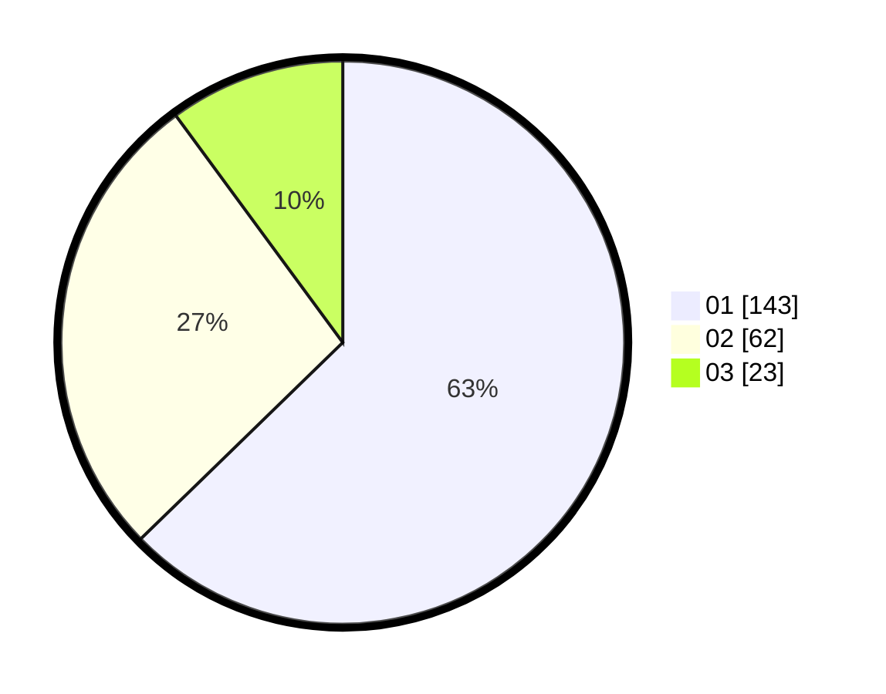

# Hasil

Hasil perolehan suara paslon dapat dilihat pada file paslon-01.txt, paslon-02.txt, dan paslon-03.txt.

Jika tidak ada, artinya data tersebut belum ada pada SIREKAP.

## Perolehan Suara

 * Paslon 01: **143**.
 * Paslon 02: **62**.
 * Paslon 03: **23**.

## Foto C Plano

https://sirekap-obj-formc.kpu.go.id/9ef7/pemilu/ppwp/31/75/04/10/05/3175041005044-20240214-211203--160965c5-c239-4c06-955e-a15a1004c61f.jpg

https://sirekap-obj-formc.kpu.go.id/9ef7/pemilu/ppwp/31/75/04/10/05/3175041005044-20240217-175704--638a6d02-1a2b-4cee-bd2d-cd64619ee097.jpg

https://sirekap-obj-formc.kpu.go.id/9ef7/pemilu/ppwp/31/75/04/10/05/3175041005044-20240214-211309--b87108a9-2edb-4f20-9fc9-9351d0f8de42.jpg

## DATA PEMILIH TETAP

Jumlah pemilih dalam DPT: **277**.
 * L: **135**.
 * P: **142**.

## DATA PENGGUNA HAK PILIH

Jumlah pengguna hak pilih dalam DPT: **230**.
 * L: **112**.
 * P: **118**.

Jumlah pengguna hak pilih dalam DPTb: **0**.
 * L: **0**.
 * P: **0**.

Jumlah pengguna hak pilih dalam DPK: **0**.
 * L: **0**.
 * P: **0**.

Jumlah pengguna hak pilih: **230**.
 * L: **112**.
 * P: **118**.

## JUMLAH SUARA SAH DAN TIDAK SAH

JUMLAH SELURUH SUARA SAH: **228**.

JUMLAH SUARA TIDAK SAH: **2**.

JUMLAH SELURUH SUARA SAH DAN SUARA TIDAK SAH: **230**.
