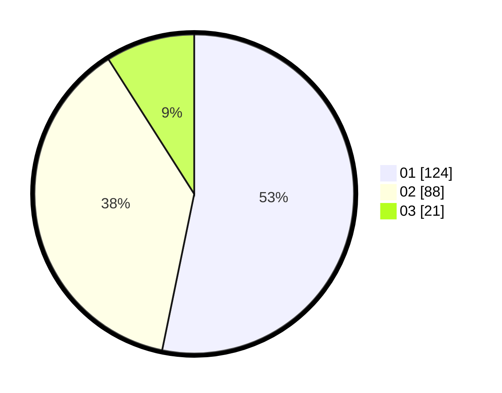

# Hasil

Hasil perolehan suara paslon dapat dilihat pada file paslon-01.txt, paslon-02.txt, dan paslon-03.txt.

Jika tidak ada, artinya data tersebut belum ada pada SIREKAP.

## Perolehan Suara

 * Paslon 01: **124**.
 * Paslon 02: **88**.
 * Paslon 03: **21**.

## Foto C Plano

https://sirekap-obj-formc.kpu.go.id/77b3/pemilu/ppwp/31/75/04/10/05/3175041005045-20240218-214637--199a6b78-76c3-4763-8290-58ccd2a053f4.jpg

https://sirekap-obj-formc.kpu.go.id/77b3/pemilu/ppwp/31/75/04/10/05/3175041005045-20240218-221047--f50ad35b-1571-4a75-9646-552d6e602052.jpg

https://sirekap-obj-formc.kpu.go.id/77b3/pemilu/ppwp/31/75/04/10/05/3175041005045-20240218-220535--2739aa4a-53f6-4c89-8259-487d0c98a833.jpg

## DATA PEMILIH TETAP

Jumlah pemilih dalam DPT: **288**.
 * L: **151**.
 * P: **137**.

## DATA PENGGUNA HAK PILIH

Jumlah pengguna hak pilih dalam DPT: **230**.
 * L: **117**.
 * P: **113**.

Jumlah pengguna hak pilih dalam DPTb: **2**.
 * L: **1**.
 * P: **1**.

Jumlah pengguna hak pilih dalam DPK: **4**.
 * L: **2**.
 * P: **2**.

Jumlah pengguna hak pilih: **236**.
 * L: **120**.
 * P: **116**.

## JUMLAH SUARA SAH DAN TIDAK SAH

JUMLAH SELURUH SUARA SAH: **233**.

JUMLAH SUARA TIDAK SAH: **3**.

JUMLAH SELURUH SUARA SAH DAN SUARA TIDAK SAH: **236**.
