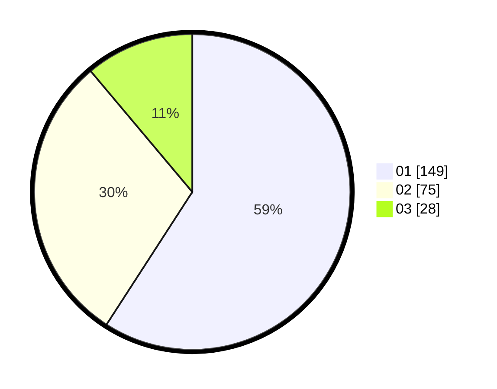

# Hasil

Hasil perolehan suara paslon dapat dilihat pada file paslon-01.txt, paslon-02.txt, dan paslon-03.txt.

Jika tidak ada, artinya data tersebut belum ada pada SIREKAP.

## Perolehan Suara

 * Paslon 01: **149**.
 * Paslon 02: **75**.
 * Paslon 03: **28**.

## Foto C Plano

https://sirekap-obj-formc.kpu.go.id/0134/pemilu/ppwp/31/75/04/10/05/3175041005052-20240215-033037--cef5eb19-899a-41a0-9da5-5d9aba6fd08b.jpg

https://sirekap-obj-formc.kpu.go.id/0134/pemilu/ppwp/31/75/04/10/05/3175041005052-20240214-212624--220b9ea2-d458-4d60-9e2d-6673c0f8e831.jpg

https://sirekap-obj-formc.kpu.go.id/0134/pemilu/ppwp/31/75/04/10/05/3175041005052-20240214-212734--40994771-0f5c-4a2e-9c1a-f5e8e3682db1.jpg
