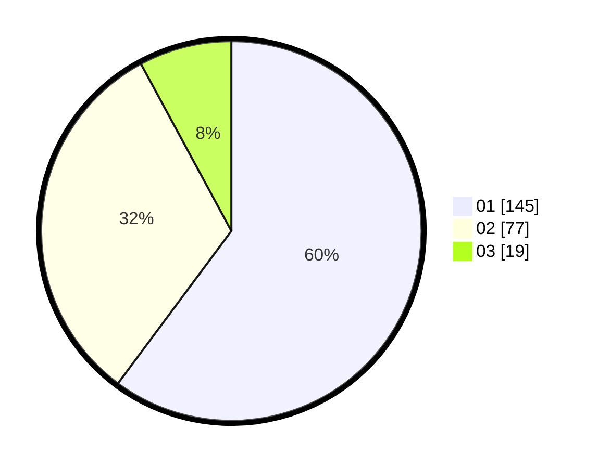

# Hasil

Hasil perolehan suara paslon dapat dilihat pada file paslon-01.txt, paslon-02.txt, dan paslon-03.txt.

Jika tidak ada, artinya data tersebut belum ada pada SIREKAP.

## Perolehan Suara

 * Paslon 01: **145**.
 * Paslon 02: **77**.
 * Paslon 03: **19**.

## Foto C Plano

https://sirekap-obj-formc.kpu.go.id/8683/pemilu/ppwp/31/75/04/10/05/3175041005056-20240219-103428--0e684c49-71b0-4209-9410-f9475461c3a5.jpg

https://sirekap-obj-formc.kpu.go.id/8683/pemilu/ppwp/31/75/04/10/05/3175041005056-20240214-221725--feda91d9-7fe2-4dc8-ae4b-a385e6788872.jpg

https://sirekap-obj-formc.kpu.go.id/8683/pemilu/ppwp/31/75/04/10/05/3175041005056-20240219-104227--e55633c9-20f2-4a21-b00f-2b55f628d7cc.jpg
