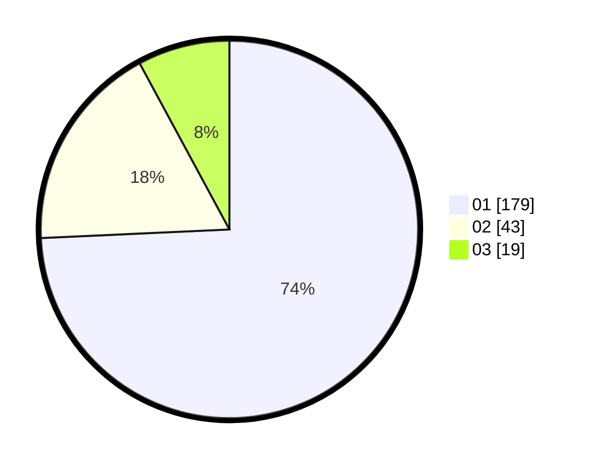

# Hasil

Hasil perolehan suara paslon dapat dilihat pada file paslon-01.txt, paslon-02.txt, dan paslon-03.txt.

Jika tidak ada, artinya data tersebut belum ada pada SIREKAP.

## Perolehan Suara

 * Paslon 01: **179**.
 * Paslon 02: **43**.
 * Paslon 03: **19**.

## Foto C Plano

https://sirekap-obj-formc.kpu.go.id/3b7c/pemilu/ppwp/31/75/04/10/05/3175041005059-20240215-053319--2fba5d8b-4e25-4d26-944a-827b236b42c6.jpg

https://sirekap-obj-formc.kpu.go.id/3b7c/pemilu/ppwp/31/75/04/10/05/3175041005059-20240215-053431--fda1f304-c065-4f6e-b98d-622baae5bf4d.jpg

https://sirekap-obj-formc.kpu.go.id/3b7c/pemilu/ppwp/31/75/04/10/05/3175041005059-20240214-194352--01af6009-70ae-4d72-b1d7-dce7154962f3.jpg
