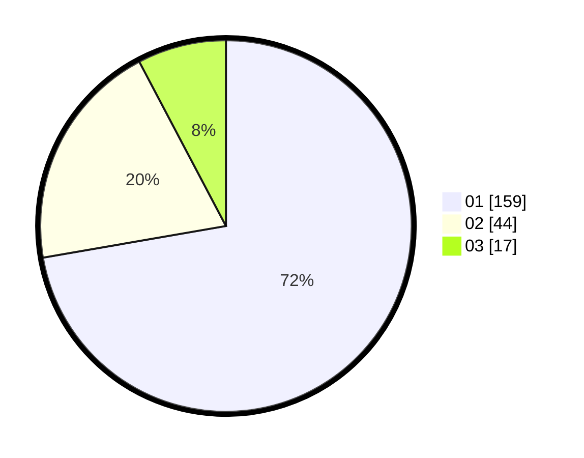

# Hasil

Hasil perolehan suara paslon dapat dilihat pada file paslon-01.txt, paslon-02.txt, dan paslon-03.txt.

Jika tidak ada, artinya data tersebut belum ada pada SIREKAP.

## Perolehan Suara

 * Paslon 01: **159**.
 * Paslon 02: **44**.
 * Paslon 03: **17**.

## Foto C Plano

https://sirekap-obj-formc.kpu.go.id/367e/pemilu/ppwp/31/75/04/10/05/3175041005064-20240214-192053--7f96756f-ea58-4daa-9f93-1521c9547a20.jpg

https://sirekap-obj-formc.kpu.go.id/367e/pemilu/ppwp/31/75/04/10/05/3175041005064-20240214-192152--02484ed0-481e-4daa-bb59-e0f5250a1e9f.jpg

https://sirekap-obj-formc.kpu.go.id/367e/pemilu/ppwp/31/75/04/10/05/3175041005064-20240214-223129--fc7dcbbb-9ad1-4014-b0e6-0d64d3c35f4f.jpg

## DATA PEMILIH TETAP

Jumlah pemilih dalam DPT: **281**.
 * L: **133**.
 * P: **148**.

## DATA PENGGUNA HAK PILIH

Jumlah pengguna hak pilih dalam DPT: **219**.
 * L: **97**.
 * P: **122**.

Jumlah pengguna hak pilih dalam DPTb: **3**.
 * L: **1**.
 * P: **2**.

Jumlah pengguna hak pilih dalam DPK: **1**.
 * L: **0**.
 * P: **1**.

Jumlah pengguna hak pilih: **223**.
 * L: **98**.
 * P: **125**.

## JUMLAH SUARA SAH DAN TIDAK SAH

JUMLAH SELURUH SUARA SAH: **220**.

JUMLAH SUARA TIDAK SAH: **3**.

JUMLAH SELURUH SUARA SAH DAN SUARA TIDAK SAH: **223**.
