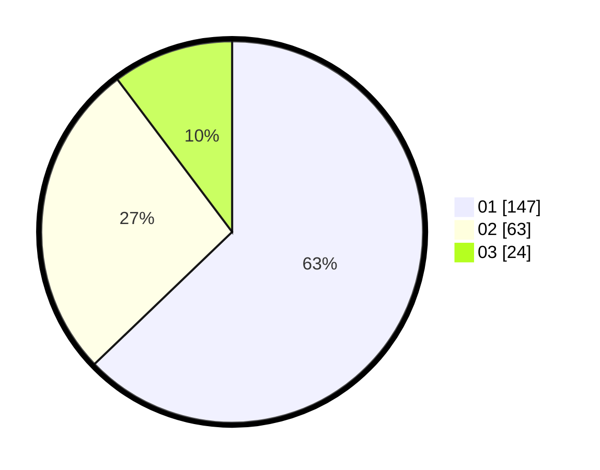

# Hasil

Hasil perolehan suara paslon dapat dilihat pada file paslon-01.txt, paslon-02.txt, dan paslon-03.txt.

Jika tidak ada, artinya data tersebut belum ada pada SIREKAP.

## Perolehan Suara

 * Paslon 01: **147**.
 * Paslon 02: **63**.
 * Paslon 03: **24**.

## Foto C Plano

https://sirekap-obj-formc.kpu.go.id/cb4f/pemilu/ppwp/31/75/04/10/05/3175041005073-20240218-194813--f578a4fb-fb97-449c-b61e-07fbf8f686a2.jpg

https://sirekap-obj-formc.kpu.go.id/cb4f/pemilu/ppwp/31/75/04/10/05/3175041005073-20240215-010602--f1d598ad-cc77-4ffd-abb7-f48fb1ee9737.jpg

https://sirekap-obj-formc.kpu.go.id/cb4f/pemilu/ppwp/31/75/04/10/05/3175041005073-20240215-010625--8c57e1b4-62c3-4b3f-9d91-87ae903ab811.jpg
