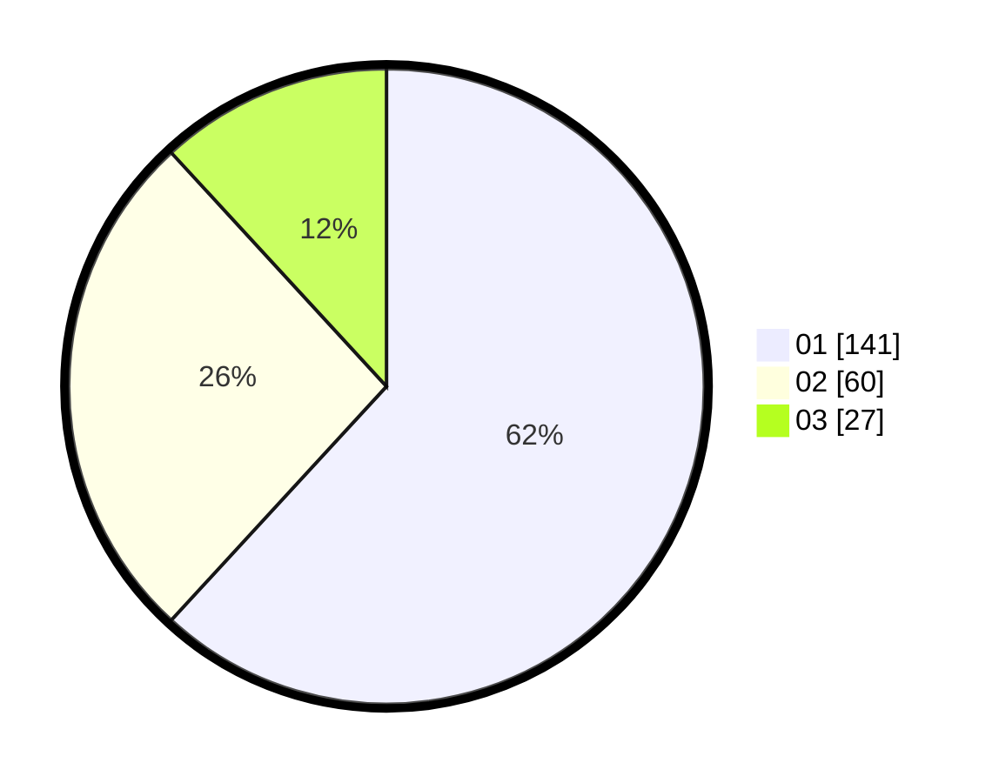

# Hasil

Hasil perolehan suara paslon dapat dilihat pada file paslon-01.txt, paslon-02.txt, dan paslon-03.txt.

Jika tidak ada, artinya data tersebut belum ada pada SIREKAP.

## Perolehan Suara

 * Paslon 01: **141**.
 * Paslon 02: **60**.
 * Paslon 03: **27**.

## Foto C Plano

https://sirekap-obj-formc.kpu.go.id/cff6/pemilu/ppwp/31/75/04/10/05/3175041005074-20240214-194527--cae49924-5ed5-442a-8285-c2170240974b.jpg

https://sirekap-obj-formc.kpu.go.id/cff6/pemilu/ppwp/31/75/04/10/05/3175041005074-20240214-194624--e7237bbf-c8cf-4136-8233-b36453614539.jpg

https://sirekap-obj-formc.kpu.go.id/cff6/pemilu/ppwp/31/75/04/10/05/3175041005074-20240214-194712--98ae6751-43f4-48dd-bfb6-404ca091fce6.jpg
