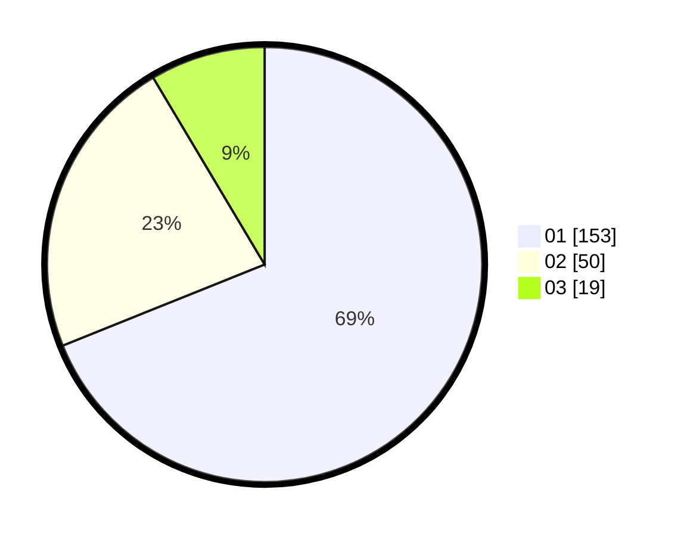

# Hasil

Hasil perolehan suara paslon dapat dilihat pada file paslon-01.txt, paslon-02.txt, dan paslon-03.txt.

Jika tidak ada, artinya data tersebut belum ada pada SIREKAP.

## Perolehan Suara

 * Paslon 01: **153**.
 * Paslon 02: **50**.
 * Paslon 03: **19**.

## Foto C Plano

https://sirekap-obj-formc.kpu.go.id/8971/pemilu/ppwp/31/75/04/10/05/3175041005076-20240215-023535--3a1a6fa9-e69d-4a24-9c56-35baa30e1b64.jpg

https://sirekap-obj-formc.kpu.go.id/8971/pemilu/ppwp/31/75/04/10/05/3175041005076-20240215-023611--e006ab5f-d29c-4e34-b32d-90cff19e6853.jpg

https://sirekap-obj-formc.kpu.go.id/8971/pemilu/ppwp/31/75/04/10/05/3175041005076-20240215-023653--be0eda69-9fdf-4718-a1a3-690af8b10b77.jpg

## DATA PEMILIH TETAP

Jumlah pemilih dalam DPT: **291**.
 * L: **141**.
 * P: **150**.

## DATA PENGGUNA HAK PILIH

Jumlah pengguna hak pilih dalam DPT: **223**.
 * L: **102**.
 * P: **121**.

Jumlah pengguna hak pilih dalam DPTb: **2**.
 * L: **0**.
 * P: **2**.

Jumlah pengguna hak pilih dalam DPK: **1**.
 * L: **0**.
 * P: **1**.

Jumlah pengguna hak pilih: **226**.
 * L: **102**.
 * P: **124**.

## JUMLAH SUARA SAH DAN TIDAK SAH

JUMLAH SELURUH SUARA SAH: **222**.

JUMLAH SUARA TIDAK SAH: **4**.

JUMLAH SELURUH SUARA SAH DAN SUARA TIDAK SAH: **226**.
