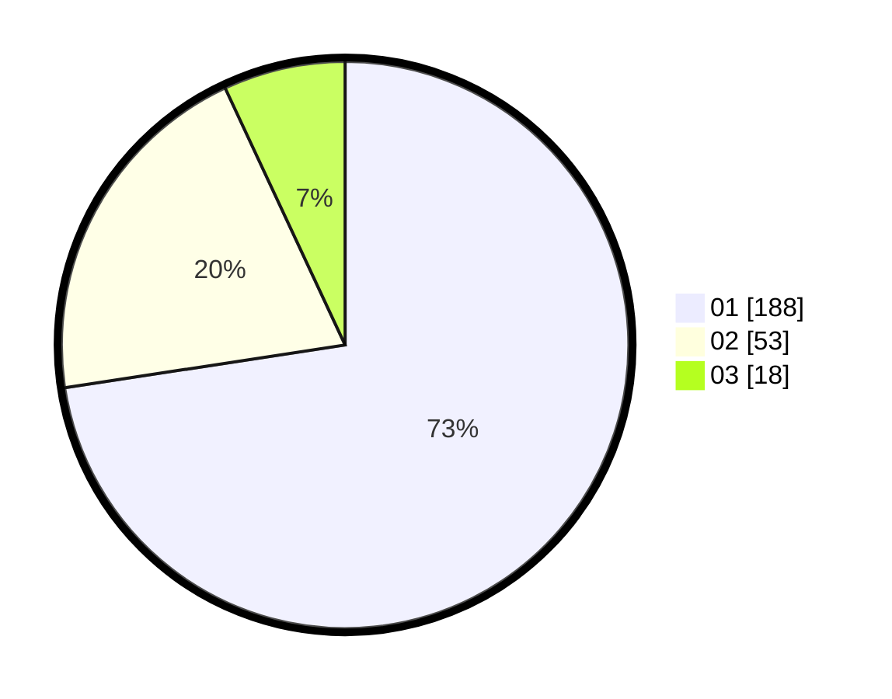

# Hasil

Hasil perolehan suara paslon dapat dilihat pada file paslon-01.txt, paslon-02.txt, dan paslon-03.txt.

Jika tidak ada, artinya data tersebut belum ada pada SIREKAP.

## Perolehan Suara

 * Paslon 01: **188**.
 * Paslon 02: **53**.
 * Paslon 03: **18**.

## Foto C Plano

https://sirekap-obj-formc.kpu.go.id/42c3/pemilu/ppwp/31/75/04/10/05/3175041005077-20240215-042253--80947136-39d3-471e-bc99-c86ad3960a19.jpg

https://sirekap-obj-formc.kpu.go.id/42c3/pemilu/ppwp/31/75/04/10/05/3175041005077-20240215-042421--78d943d7-dc2f-455e-84a6-d67d010fa6a3.jpg

https://sirekap-obj-formc.kpu.go.id/42c3/pemilu/ppwp/31/75/04/10/05/3175041005077-20240215-042545--22bc93aa-652c-4cec-a421-2f44d85c6134.jpg
