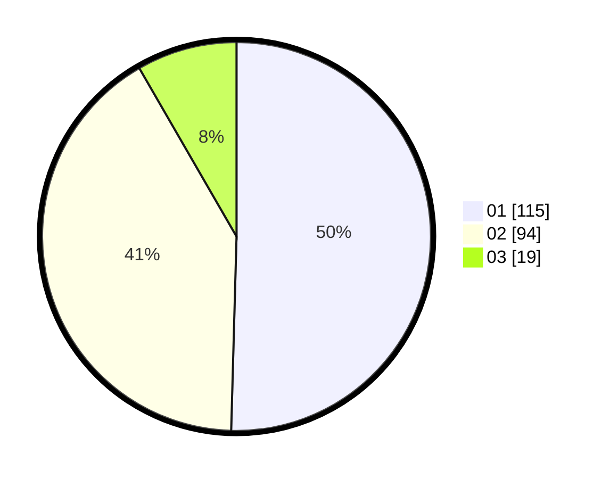

# Hasil

Hasil perolehan suara paslon dapat dilihat pada file paslon-01.txt, paslon-02.txt, dan paslon-03.txt.

Jika tidak ada, artinya data tersebut belum ada pada SIREKAP.

## Perolehan Suara

 * Paslon 01: **115**.
 * Paslon 02: **94**.
 * Paslon 03: **19**.

## Foto C Plano

https://sirekap-obj-formc.kpu.go.id/9d25/pemilu/ppwp/31/75/04/10/05/3175041005084-20240218-210639--d6ae4313-748a-4e72-9b83-626ce68c86f8.jpg

https://sirekap-obj-formc.kpu.go.id/9d25/pemilu/ppwp/31/75/04/10/05/3175041005084-20240216-201840--749b2d5c-043b-4728-85ca-181f9312eab1.jpg

https://sirekap-obj-formc.kpu.go.id/9d25/pemilu/ppwp/31/75/04/10/05/3175041005084-20240216-202734--ab11e257-1404-47fe-9940-301024d87f73.jpg

## DATA PEMILIH TETAP

Jumlah pemilih dalam DPT: **269**.
 * L: **130**.
 * P: **139**.

## DATA PENGGUNA HAK PILIH

Jumlah pengguna hak pilih dalam DPT: **226**.
 * L: **105**.
 * P: **121**.

Jumlah pengguna hak pilih dalam DPTb: **0**.
 * L: **0**.
 * P: **0**.

Jumlah pengguna hak pilih dalam DPK: **4**.
 * L: **2**.
 * P: **2**.

Jumlah pengguna hak pilih: **230**.
 * L: **107**.
 * P: **123**.

## JUMLAH SUARA SAH DAN TIDAK SAH

JUMLAH SELURUH SUARA SAH: **228**.

JUMLAH SUARA TIDAK SAH: **2**.

JUMLAH SELURUH SUARA SAH DAN SUARA TIDAK SAH: **230**.
