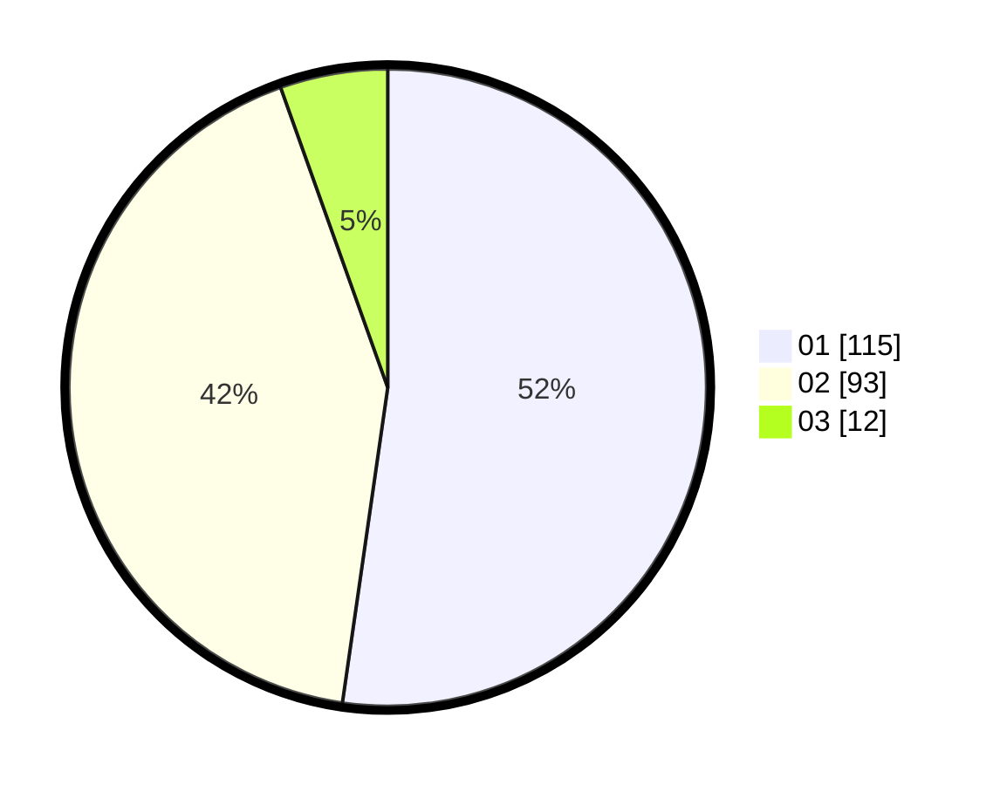

# Hasil

Hasil perolehan suara paslon dapat dilihat pada file paslon-01.txt, paslon-02.txt, dan paslon-03.txt.

Jika tidak ada, artinya data tersebut belum ada pada SIREKAP.

## Perolehan Suara

 * Paslon 01: **115**.
 * Paslon 02: **93**.
 * Paslon 03: **12**.

## Foto C Plano

https://sirekap-obj-formc.kpu.go.id/86f2/pemilu/ppwp/31/75/04/10/05/3175041005085-20240215-002651--f01803b5-f27b-4b5a-b8f7-286923650be4.jpg

https://sirekap-obj-formc.kpu.go.id/86f2/pemilu/ppwp/31/75/04/10/05/3175041005085-20240215-002918--82fd7872-ae2c-479f-89ad-8d6189a5d70e.jpg

https://sirekap-obj-formc.kpu.go.id/86f2/pemilu/ppwp/31/75/04/10/05/3175041005085-20240215-003844--1bf9c100-d05b-4660-8b4e-c2b81713971e.jpg

## DATA PEMILIH TETAP

Jumlah pemilih dalam DPT: **269**.
 * L: **134**.
 * P: **135**.

## DATA PENGGUNA HAK PILIH

Jumlah pengguna hak pilih dalam DPT: **219**.
 * L: **109**.
 * P: **110**.

Jumlah pengguna hak pilih dalam DPTb: **0**.
 * L: **0**.
 * P: **0**.

Jumlah pengguna hak pilih dalam DPK: **6**.
 * L: **4**.
 * P: **2**.

Jumlah pengguna hak pilih: **225**.
 * L: **113**.
 * P: **112**.

## JUMLAH SUARA SAH DAN TIDAK SAH

JUMLAH SELURUH SUARA SAH: **220**.

JUMLAH SUARA TIDAK SAH: **5**.

JUMLAH SELURUH SUARA SAH DAN SUARA TIDAK SAH: **225**.
