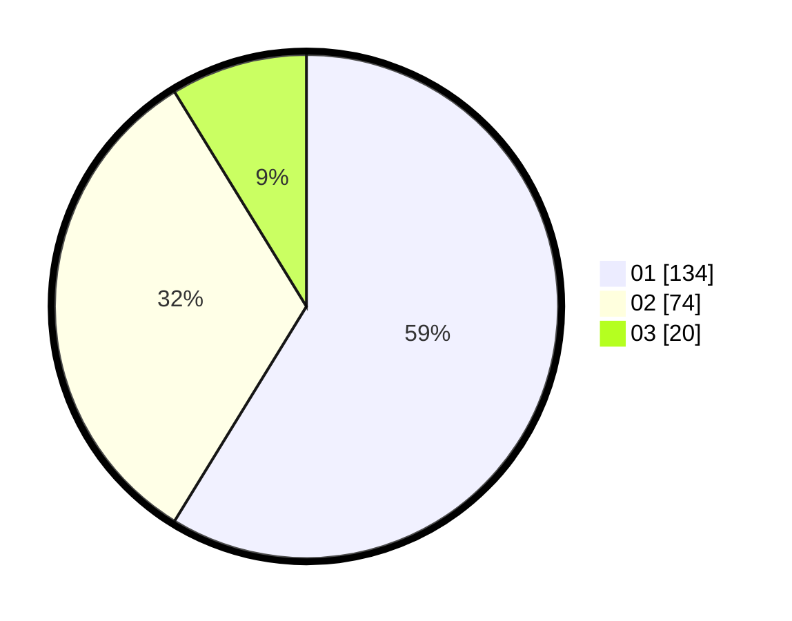

# Hasil

Hasil perolehan suara paslon dapat dilihat pada file paslon-01.txt, paslon-02.txt, dan paslon-03.txt.

Jika tidak ada, artinya data tersebut belum ada pada SIREKAP.

## Perolehan Suara

 * Paslon 01: **134**.
 * Paslon 02: **74**.
 * Paslon 03: **20**.

## Foto C Plano

https://sirekap-obj-formc.kpu.go.id/453f/pemilu/ppwp/31/75/04/10/05/3175041005096-20240216-132908--0ab2ad55-02ec-4008-8879-9a1f538a7097.jpg

https://sirekap-obj-formc.kpu.go.id/453f/pemilu/ppwp/31/75/04/10/05/3175041005096-20240216-132910--c8b82e31-8bc3-47f0-9e1c-a10c7110ce64.jpg

https://sirekap-obj-formc.kpu.go.id/453f/pemilu/ppwp/31/75/04/10/05/3175041005096-20240216-132909--78f7b403-a823-41ac-8dd5-49b47d9a01c5.jpg

## DATA PEMILIH TETAP

Jumlah pemilih dalam DPT: **285**.
 * L: **152**.
 * P: **133**.

## DATA PENGGUNA HAK PILIH

Jumlah pengguna hak pilih dalam DPT: **217**.
 * L: **117**.
 * P: **100**.

Jumlah pengguna hak pilih dalam DPTb: **0**.
 * L: **0**.
 * P: **0**.

Jumlah pengguna hak pilih dalam DPK: **15**.
 * L: **6**.
 * P: **9**.

Jumlah pengguna hak pilih: **232**.
 * L: **106**.
 * P: **126**.

## JUMLAH SUARA SAH DAN TIDAK SAH

JUMLAH SELURUH SUARA SAH: **228**.

JUMLAH SUARA TIDAK SAH: **4**.

JUMLAH SELURUH SUARA SAH DAN SUARA TIDAK SAH: **232**.
