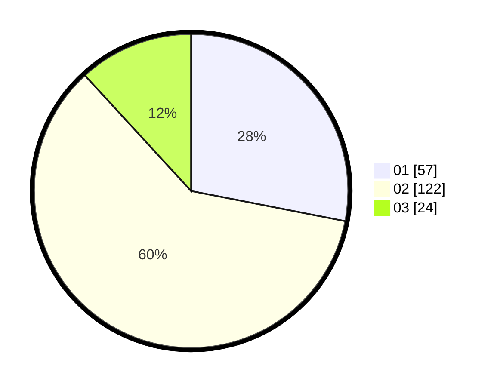

# Hasil

Hasil perolehan suara paslon dapat dilihat pada file paslon-01.txt, paslon-02.txt, dan paslon-03.txt.

Jika tidak ada, artinya data tersebut belum ada pada SIREKAP.

## Perolehan Suara

 * Paslon 01: **57**.
 * Paslon 02: **122**.
 * Paslon 03: **24**.

## Foto C Plano

https://sirekap-obj-formc.kpu.go.id/73ac/pemilu/ppwp/31/75/04/10/06/3175041006003-20240215-064319--9ef73486-ec49-41ff-b4f7-a99b3d7d4d04.jpg

https://sirekap-obj-formc.kpu.go.id/73ac/pemilu/ppwp/31/75/04/10/06/3175041006003-20240215-064411--bf9b3fbc-efcd-4ff1-bae7-342ddecaa801.jpg
