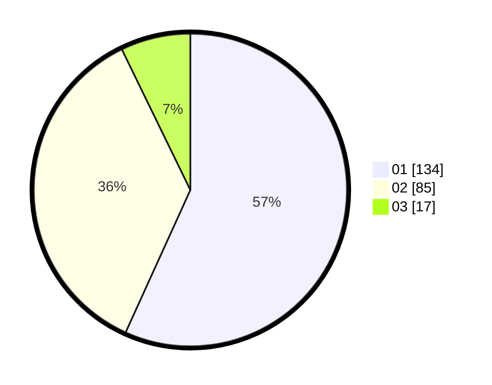

# Hasil

Hasil perolehan suara paslon dapat dilihat pada file paslon-01.txt, paslon-02.txt, dan paslon-03.txt.

Jika tidak ada, artinya data tersebut belum ada pada SIREKAP.

## Perolehan Suara

 * Paslon 01: **134**.
 * Paslon 02: **85**.
 * Paslon 03: **17**.

## Foto C Plano

https://sirekap-obj-formc.kpu.go.id/8a3c/pemilu/ppwp/31/75/04/10/06/3175041006008-20240215-010927--da525f8b-2682-468a-8c01-3d386c603157.jpg

https://sirekap-obj-formc.kpu.go.id/8a3c/pemilu/ppwp/31/75/04/10/06/3175041006008-20240215-022525--d347be92-971e-4b6e-864f-bbbe65fdcbcb.jpg

https://sirekap-obj-formc.kpu.go.id/8a3c/pemilu/ppwp/31/75/04/10/06/3175041006008-20240215-022528--5d2d555d-a801-44fa-b2db-67d1490c8189.jpg
