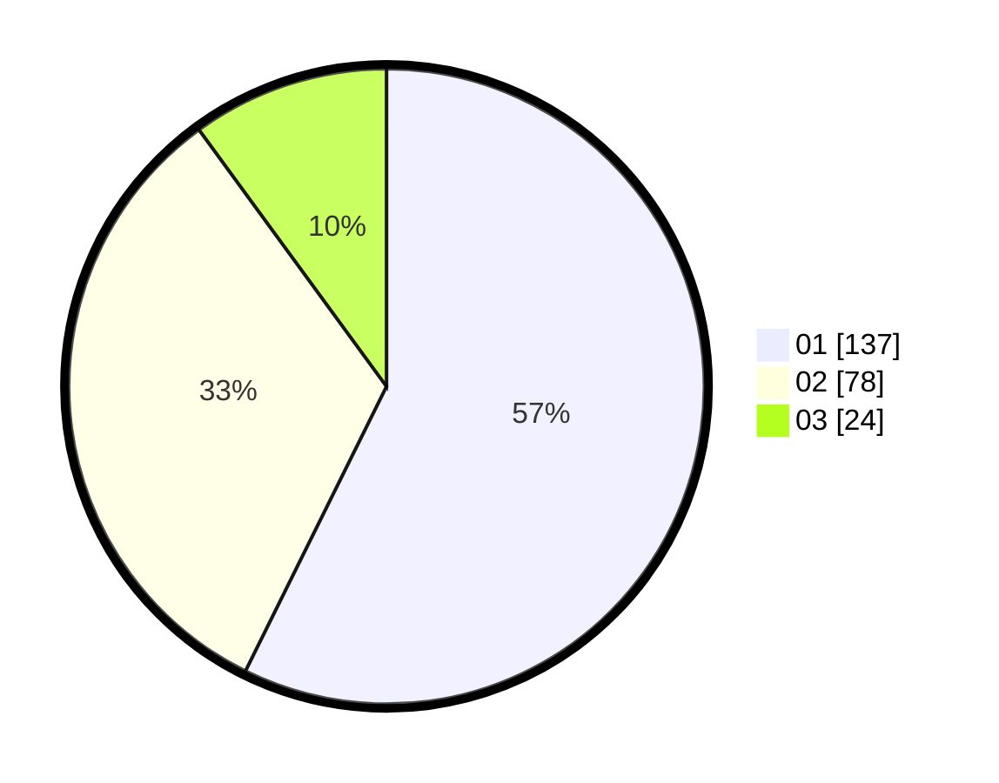

# Hasil

Hasil perolehan suara paslon dapat dilihat pada file paslon-01.txt, paslon-02.txt, dan paslon-03.txt.

Jika tidak ada, artinya data tersebut belum ada pada SIREKAP.

## Perolehan Suara

 * Paslon 01: **137**.
 * Paslon 02: **78**.
 * Paslon 03: **24**.

## Foto C Plano

https://sirekap-obj-formc.kpu.go.id/428b/pemilu/ppwp/31/75/04/10/06/3175041006014-20240214-230801--8ac6901a-c2ac-46e6-aae2-09795dcaad56.jpg

https://sirekap-obj-formc.kpu.go.id/428b/pemilu/ppwp/31/75/04/10/06/3175041006014-20240214-230952--8a655d1b-812d-4058-b2bc-176c1e4748e2.jpg

https://sirekap-obj-formc.kpu.go.id/428b/pemilu/ppwp/31/75/04/10/06/3175041006014-20240214-212500--45a7ae91-6101-43d0-8bce-8c5737371409.jpg
