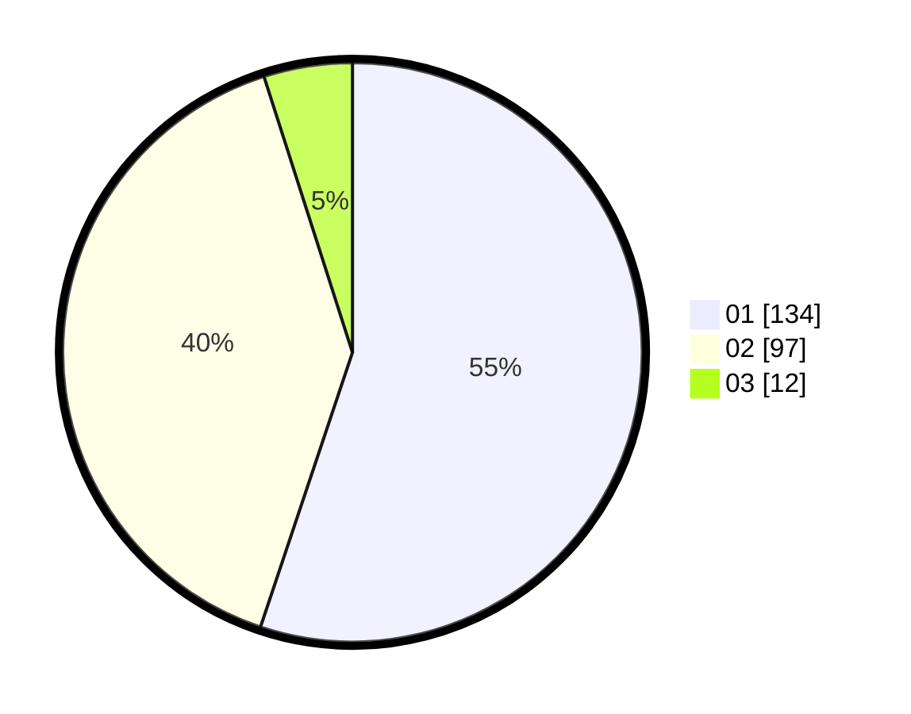

# Hasil

Hasil perolehan suara paslon dapat dilihat pada file paslon-01.txt, paslon-02.txt, dan paslon-03.txt.

Jika tidak ada, artinya data tersebut belum ada pada SIREKAP.

## Perolehan Suara

 * Paslon 01: **134**.
 * Paslon 02: **97**.
 * Paslon 03: **12**.

## Foto C Plano

https://sirekap-obj-formc.kpu.go.id/5a22/pemilu/ppwp/31/75/04/10/06/3175041006018-20240217-014917--2925812b-1f99-45c2-9814-6e0c2460a574.jpg

https://sirekap-obj-formc.kpu.go.id/5a22/pemilu/ppwp/31/75/04/10/06/3175041006018-20240217-014919--7e3b8baa-4632-4286-bf7e-5876f3a0eedf.jpg

https://sirekap-obj-formc.kpu.go.id/5a22/pemilu/ppwp/31/75/04/10/06/3175041006018-20240217-014918--4698e480-cc95-4ebd-9fab-b59d5612408e.jpg

## DATA PEMILIH TETAP

Jumlah pemilih dalam DPT: **291**.
 * L: **145**.
 * P: **146**.

## DATA PENGGUNA HAK PILIH

Jumlah pengguna hak pilih dalam DPT: **241**.
 * L: **116**.
 * P: **125**.

Jumlah pengguna hak pilih dalam DPTb: **3**.
 * L: **2**.
 * P: **1**.

Jumlah pengguna hak pilih dalam DPK: **1**.
 * L: **1**.
 * P: **0**.

Jumlah pengguna hak pilih: **245**.
 * L: **119**.
 * P: **126**.

## JUMLAH SUARA SAH DAN TIDAK SAH

JUMLAH SELURUH SUARA SAH: **243**.

JUMLAH SUARA TIDAK SAH: **2**.

JUMLAH SELURUH SUARA SAH DAN SUARA TIDAK SAH: **245**.
