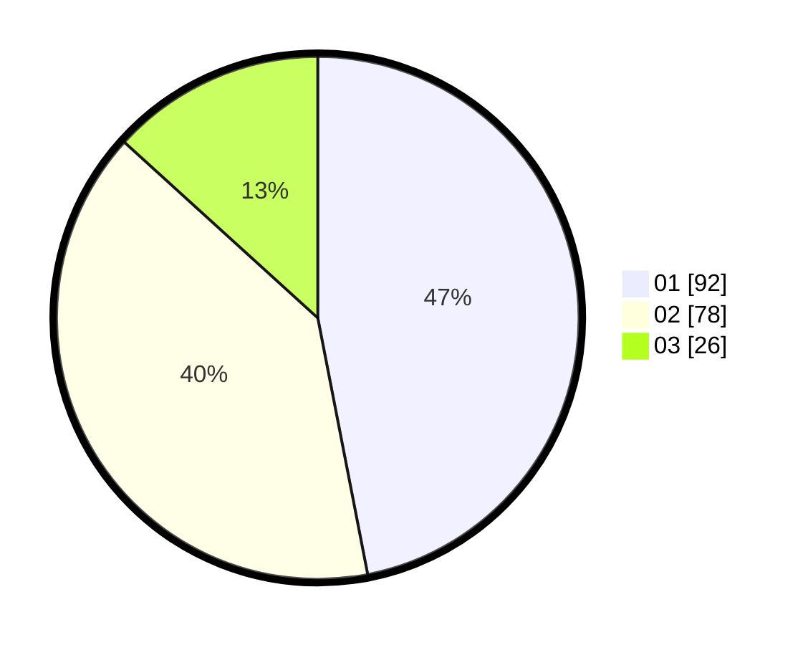

# Hasil

Hasil perolehan suara paslon dapat dilihat pada file paslon-01.txt, paslon-02.txt, dan paslon-03.txt.

Jika tidak ada, artinya data tersebut belum ada pada SIREKAP.

## Perolehan Suara

 * Paslon 01: **92**.
 * Paslon 02: **78**.
 * Paslon 03: **26**.

## Foto C Plano

https://sirekap-obj-formc.kpu.go.id/8087/pemilu/ppwp/31/75/04/10/06/3175041006023-20240214-155337--8299228e-8d4d-49b5-a386-c3e8e35639ed.jpg

https://sirekap-obj-formc.kpu.go.id/8087/pemilu/ppwp/31/75/04/10/06/3175041006023-20240214-155340--b581e6ec-6c65-4fa7-94cb-e61cb238edec.jpg

https://sirekap-obj-formc.kpu.go.id/8087/pemilu/ppwp/31/75/04/10/06/3175041006023-20240214-155352--ebe3c4a7-8aa6-4d83-b9d0-8e19c42c5b0e.jpg

## DATA PEMILIH TETAP

Jumlah pemilih dalam DPT: **263**.
 * L: **132**.
 * P: **131**.

## DATA PENGGUNA HAK PILIH

Jumlah pengguna hak pilih dalam DPT: **190**.
 * L: **93**.
 * P: **97**.

Jumlah pengguna hak pilih dalam DPTb: **7**.
 * L: **4**.
 * P: **3**.

Jumlah pengguna hak pilih dalam DPK: **1**.
 * L: **1**.
 * P: **0**.

Jumlah pengguna hak pilih: **198**.
 * L: **98**.
 * P: **100**.

## JUMLAH SUARA SAH DAN TIDAK SAH

JUMLAH SELURUH SUARA SAH: **196**.

JUMLAH SUARA TIDAK SAH: **2**.

JUMLAH SELURUH SUARA SAH DAN SUARA TIDAK SAH: **198**.
