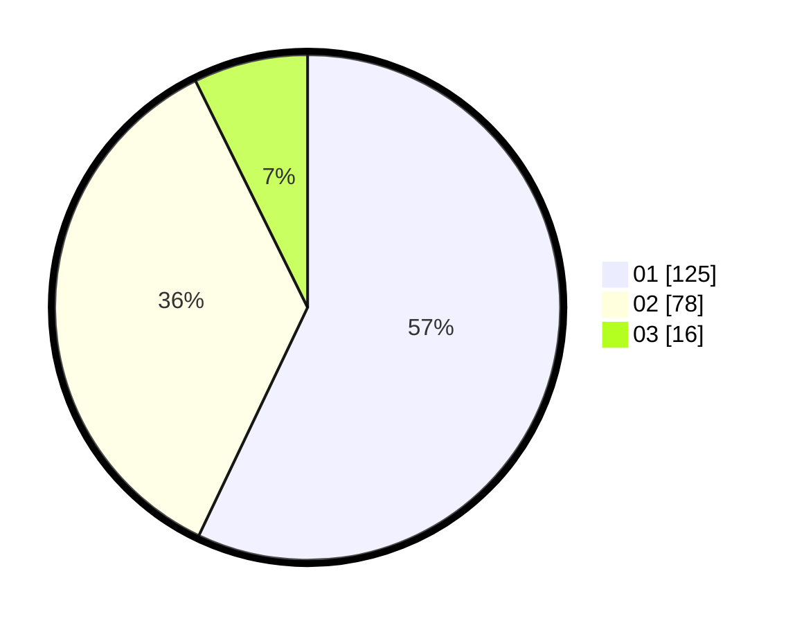

# Hasil

Hasil perolehan suara paslon dapat dilihat pada file paslon-01.txt, paslon-02.txt, dan paslon-03.txt.

Jika tidak ada, artinya data tersebut belum ada pada SIREKAP.

## Perolehan Suara

 * Paslon 01: **125**.
 * Paslon 02: **78**.
 * Paslon 03: **16**.

## Foto C Plano

https://sirekap-obj-formc.kpu.go.id/bf73/pemilu/ppwp/31/75/04/10/06/3175041006033-20240214-155332--199b80b8-3dbe-4ef8-9599-c9ff70b24c5f.jpg

https://sirekap-obj-formc.kpu.go.id/bf73/pemilu/ppwp/31/75/04/10/06/3175041006033-20240214-155522--703f988c-a187-4c80-8baf-c338018223f6.jpg

https://sirekap-obj-formc.kpu.go.id/bf73/pemilu/ppwp/31/75/04/10/06/3175041006033-20240214-155917--9686a1b1-789b-4378-9f10-f9462f1149b5.jpg

## DATA PEMILIH TETAP

Jumlah pemilih dalam DPT: **289**.
 * L: **150**.
 * P: **139**.

## DATA PENGGUNA HAK PILIH

Jumlah pengguna hak pilih dalam DPT: **217**.
 * L: **110**.
 * P: **107**.

Jumlah pengguna hak pilih dalam DPTb: **8**.
 * L: **1**.
 * P: **7**.

Jumlah pengguna hak pilih dalam DPK: **1**.
 * L: **1**.
 * P: **0**.

Jumlah pengguna hak pilih: **226**.
 * L: **112**.
 * P: **114**.

## JUMLAH SUARA SAH DAN TIDAK SAH

JUMLAH SELURUH SUARA SAH: **219**.

JUMLAH SUARA TIDAK SAH: **7**.

JUMLAH SELURUH SUARA SAH DAN SUARA TIDAK SAH: **226**.
