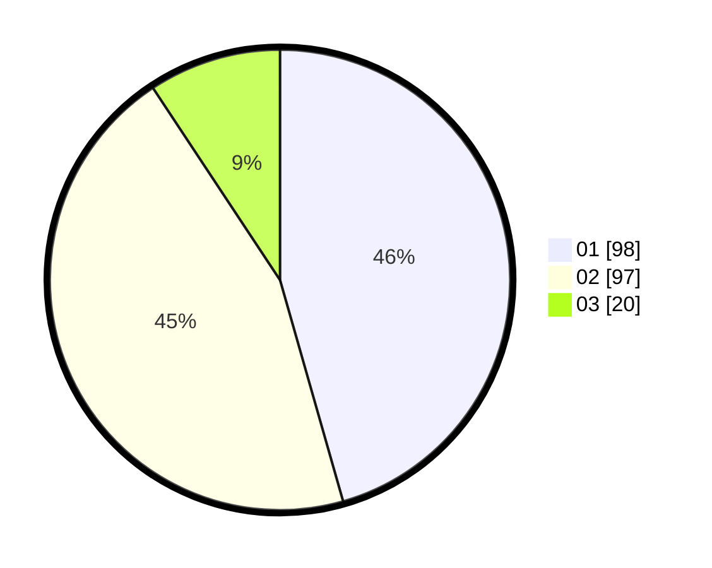

# Hasil

Hasil perolehan suara paslon dapat dilihat pada file paslon-01.txt, paslon-02.txt, dan paslon-03.txt.

Jika tidak ada, artinya data tersebut belum ada pada SIREKAP.

## Perolehan Suara

 * Paslon 01: **98**.
 * Paslon 02: **97**.
 * Paslon 03: **20**.

## Foto C Plano

https://sirekap-obj-formc.kpu.go.id/6b93/pemilu/ppwp/31/75/04/10/06/3175041006040-20240214-200654--45464127-d7b5-4284-b671-661876715b39.jpg

https://sirekap-obj-formc.kpu.go.id/6b93/pemilu/ppwp/31/75/04/10/06/3175041006040-20240214-210007--e7c8c9b8-27fa-4078-98c4-6e55c5577678.jpg

https://sirekap-obj-formc.kpu.go.id/6b93/pemilu/ppwp/31/75/04/10/06/3175041006040-20240214-200209--4724088c-32fd-4763-bec0-f042e94f3063.jpg

## DATA PEMILIH TETAP

Jumlah pemilih dalam DPT: **273**.
 * L: **139**.
 * P: **134**.

## DATA PENGGUNA HAK PILIH

Jumlah pengguna hak pilih dalam DPT: **215**.
 * L: **109**.
 * P: **106**.

Jumlah pengguna hak pilih dalam DPTb: **0**.
 * L: **0**.
 * P: **0**.

Jumlah pengguna hak pilih dalam DPK: **0**.
 * L: **0**.
 * P: **0**.

Jumlah pengguna hak pilih: **215**.
 * L: **109**.
 * P: **106**.

## JUMLAH SUARA SAH DAN TIDAK SAH

JUMLAH SELURUH SUARA SAH: **215**.

JUMLAH SUARA TIDAK SAH: **0**.

JUMLAH SELURUH SUARA SAH DAN SUARA TIDAK SAH: **215**.
