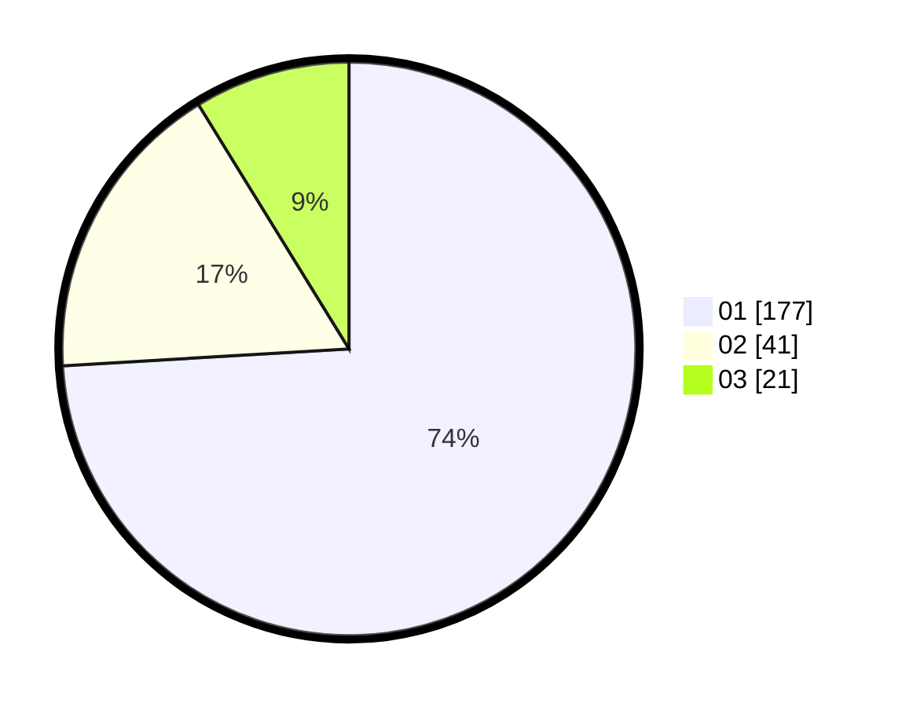

# Hasil

Hasil perolehan suara paslon dapat dilihat pada file paslon-01.txt, paslon-02.txt, dan paslon-03.txt.

Jika tidak ada, artinya data tersebut belum ada pada SIREKAP.

## Perolehan Suara

 * Paslon 01: **177**.
 * Paslon 02: **41**.
 * Paslon 03: **21**.

## Foto C Plano

https://sirekap-obj-formc.kpu.go.id/6adb/pemilu/ppwp/31/75/04/10/06/3175041006043-20240214-225751--e1d93dac-876a-41ea-88cf-a9a5d79a07d9.jpg

https://sirekap-obj-formc.kpu.go.id/6adb/pemilu/ppwp/31/75/04/10/06/3175041006043-20240215-002245--8881ba57-60be-4122-a7e9-6f630793972d.jpg

https://sirekap-obj-formc.kpu.go.id/6adb/pemilu/ppwp/31/75/04/10/06/3175041006043-20240215-002318--5477a323-c5ee-486c-9d18-852d815540ff.jpg
