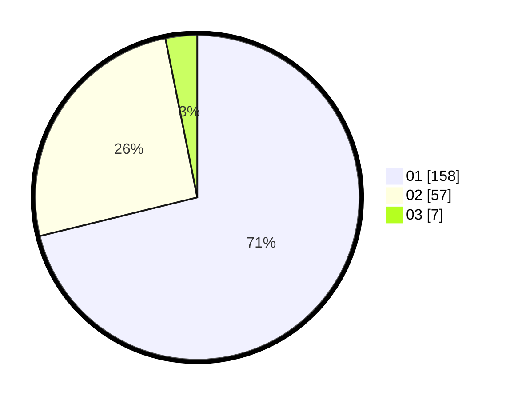

# Hasil

Hasil perolehan suara paslon dapat dilihat pada file paslon-01.txt, paslon-02.txt, dan paslon-03.txt.

Jika tidak ada, artinya data tersebut belum ada pada SIREKAP.

## Perolehan Suara

 * Paslon 01: **158**.
 * Paslon 02: **57**.
 * Paslon 03: **7**.

## Foto C Plano

https://sirekap-obj-formc.kpu.go.id/b9bd/pemilu/ppwp/31/75/04/10/06/3175041006055-20240214-194154--af138bc4-61e5-4080-9618-63e805516a32.jpg

https://sirekap-obj-formc.kpu.go.id/b9bd/pemilu/ppwp/31/75/04/10/06/3175041006055-20240214-194202--1cce0634-fdee-40c9-86a3-bbba8b89ce62.jpg

https://sirekap-obj-formc.kpu.go.id/b9bd/pemilu/ppwp/31/75/04/10/06/3175041006055-20240214-194207--53b1f51b-6e75-473e-9ff5-06d79d32c54f.jpg
