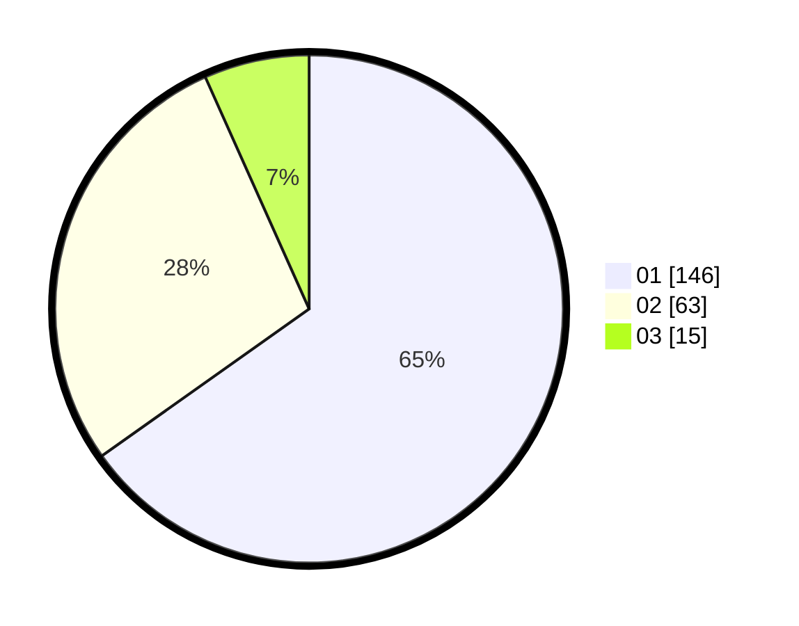

# Hasil

Hasil perolehan suara paslon dapat dilihat pada file paslon-01.txt, paslon-02.txt, dan paslon-03.txt.

Jika tidak ada, artinya data tersebut belum ada pada SIREKAP.

## Perolehan Suara

 * Paslon 01: **146**.
 * Paslon 02: **63**.
 * Paslon 03: **15**.

## Foto C Plano

https://sirekap-obj-formc.kpu.go.id/8e0a/pemilu/ppwp/31/75/04/10/06/3175041006056-20240214-210732--f327dcbc-7884-4812-b15a-54443bd1b4fa.jpg

https://sirekap-obj-formc.kpu.go.id/8e0a/pemilu/ppwp/31/75/04/10/06/3175041006056-20240214-210843--a22a8351-3e94-4d58-b219-74c84cacfa27.jpg

https://sirekap-obj-formc.kpu.go.id/8e0a/pemilu/ppwp/31/75/04/10/06/3175041006056-20240215-152052--6f1d6b03-a09f-47f8-894a-407557c0845e.jpg
