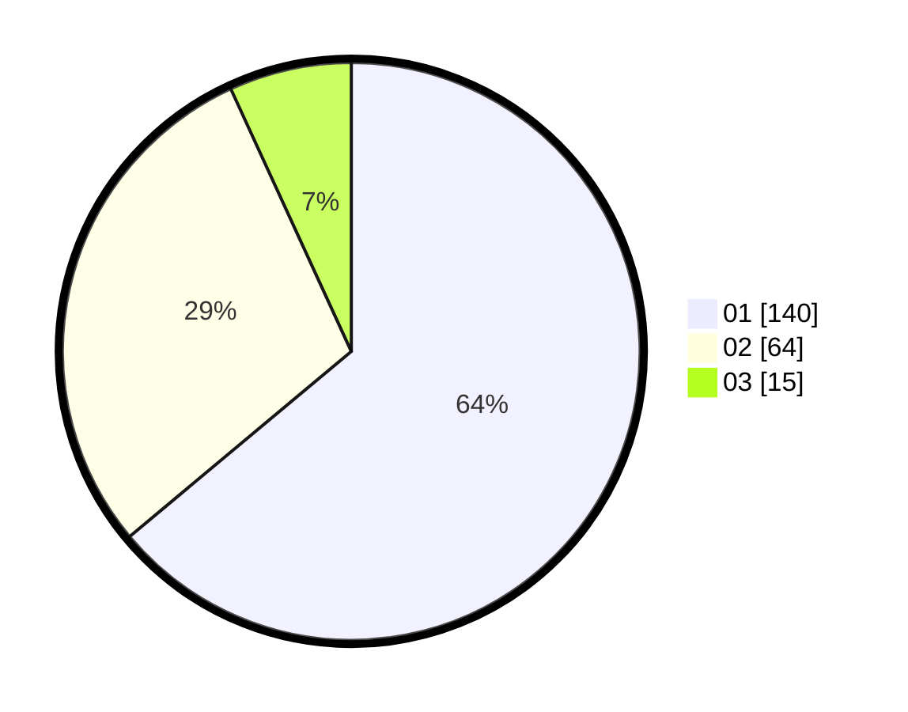

# Hasil

Hasil perolehan suara paslon dapat dilihat pada file paslon-01.txt, paslon-02.txt, dan paslon-03.txt.

Jika tidak ada, artinya data tersebut belum ada pada SIREKAP.

## Perolehan Suara

 * Paslon 01: **140**.
 * Paslon 02: **64**.
 * Paslon 03: **15**.

## Foto C Plano

https://sirekap-obj-formc.kpu.go.id/3d5b/pemilu/ppwp/31/75/04/10/06/3175041006062-20240214-212742--2c0a6d6b-da67-48c5-b265-5a92c6871702.jpg

https://sirekap-obj-formc.kpu.go.id/3d5b/pemilu/ppwp/31/75/04/10/06/3175041006062-20240215-000649--e3ed41ef-e330-435e-8344-ebbe758b95e9.jpg

https://sirekap-obj-formc.kpu.go.id/3d5b/pemilu/ppwp/31/75/04/10/06/3175041006062-20240214-213037--6e4e3540-1a47-401e-989c-bb1ecf3bafc2.jpg
