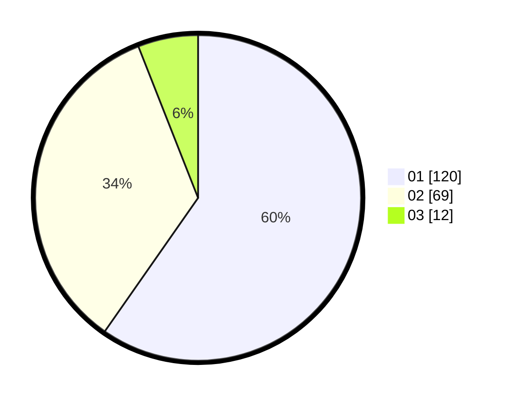

# Hasil

Hasil perolehan suara paslon dapat dilihat pada file paslon-01.txt, paslon-02.txt, dan paslon-03.txt.

Jika tidak ada, artinya data tersebut belum ada pada SIREKAP.

## Perolehan Suara

 * Paslon 01: **120**.
 * Paslon 02: **69**.
 * Paslon 03: **12**.

## Foto C Plano

https://sirekap-obj-formc.kpu.go.id/dcc1/pemilu/ppwp/31/75/04/10/06/3175041006064-20240215-190649--7782892b-3a8a-4898-a2ca-cc363608feba.jpg

https://sirekap-obj-formc.kpu.go.id/dcc1/pemilu/ppwp/31/75/04/10/06/3175041006064-20240215-132306--43f7ce6b-341f-406a-be46-92bbe2392362.jpg

https://sirekap-obj-formc.kpu.go.id/dcc1/pemilu/ppwp/31/75/04/10/06/3175041006064-20240215-132114--aa22e0be-eb96-4e96-8a02-805545b0e940.jpg
