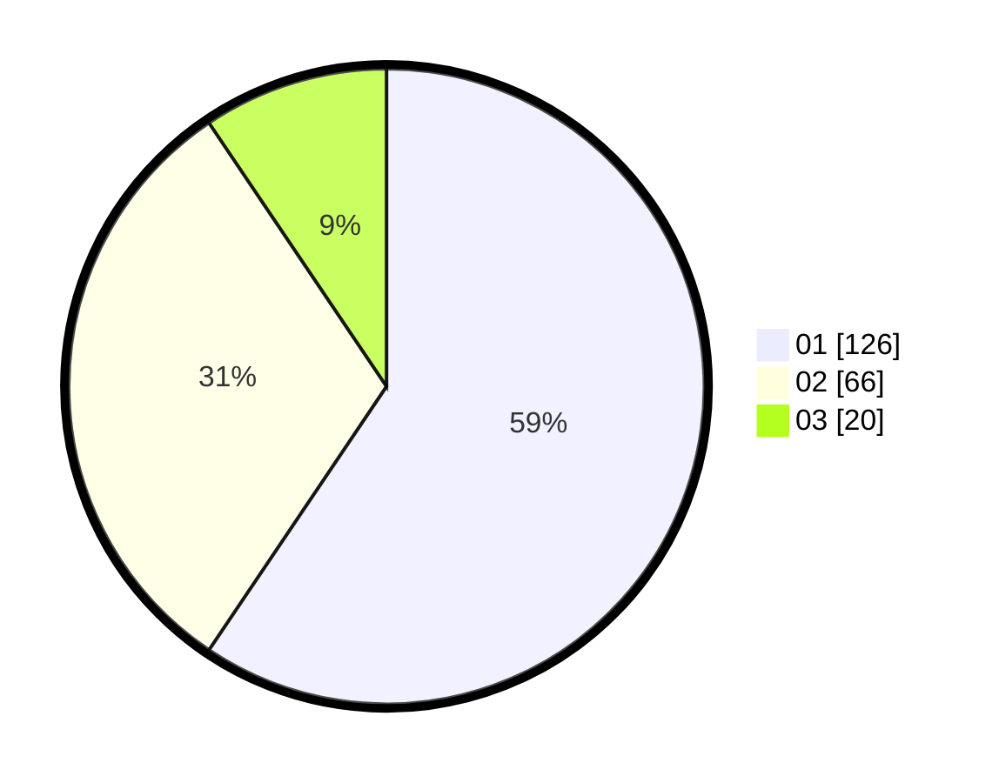

# Hasil

Hasil perolehan suara paslon dapat dilihat pada file paslon-01.txt, paslon-02.txt, dan paslon-03.txt.

Jika tidak ada, artinya data tersebut belum ada pada SIREKAP.

## Perolehan Suara

 * Paslon 01: **126**.
 * Paslon 02: **66**.
 * Paslon 03: **20**.

## Foto C Plano

https://sirekap-obj-formc.kpu.go.id/8306/pemilu/ppwp/31/75/04/10/06/3175041006066-20240215-204833--641d8583-6988-4d1f-8ac0-0c0fd7ee3b55.jpg

https://sirekap-obj-formc.kpu.go.id/8306/pemilu/ppwp/31/75/04/10/06/3175041006066-20240215-204835--ed1593bd-98f8-4419-b0c2-9ec6d1695401.jpg

https://sirekap-obj-formc.kpu.go.id/8306/pemilu/ppwp/31/75/04/10/06/3175041006066-20240215-204834--1242daa1-d992-4349-aa8e-befd80f5510d.jpg

## DATA PEMILIH TETAP

Jumlah pemilih dalam DPT: **265**.
 * L: **132**.
 * P: **133**.

## DATA PENGGUNA HAK PILIH

Jumlah pengguna hak pilih dalam DPT: **208**.
 * L: **98**.
 * P: **110**.

Jumlah pengguna hak pilih dalam DPTb: **1**.
 * L: **0**.
 * P: **1**.

Jumlah pengguna hak pilih dalam DPK: **4**.
 * L: **2**.
 * P: **2**.

Jumlah pengguna hak pilih: **213**.
 * L: **100**.
 * P: **113**.

## JUMLAH SUARA SAH DAN TIDAK SAH

JUMLAH SELURUH SUARA SAH: **212**.

JUMLAH SUARA TIDAK SAH: **1**.

JUMLAH SELURUH SUARA SAH DAN SUARA TIDAK SAH: **213**.
