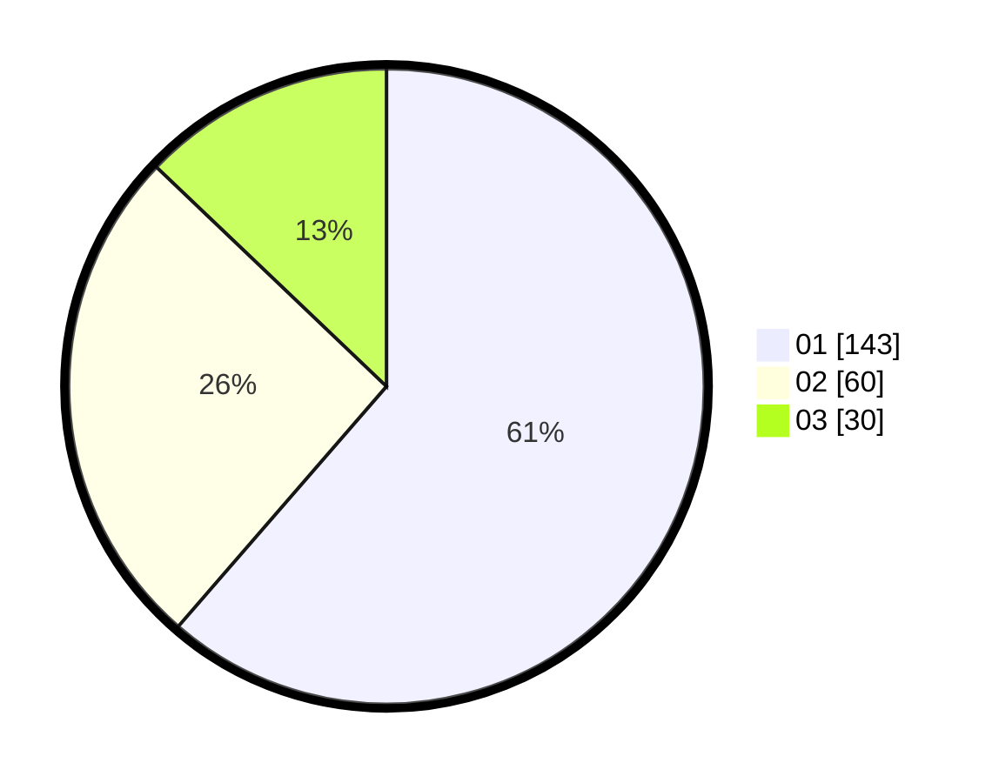

# Hasil

Hasil perolehan suara paslon dapat dilihat pada file paslon-01.txt, paslon-02.txt, dan paslon-03.txt.

Jika tidak ada, artinya data tersebut belum ada pada SIREKAP.

## Perolehan Suara

 * Paslon 01: **143**.
 * Paslon 02: **60**.
 * Paslon 03: **30**.

## Foto C Plano

https://sirekap-obj-formc.kpu.go.id/55e8/pemilu/ppwp/31/75/04/10/06/3175041006072-20240214-231421--224cc6e1-65f1-4a63-ac0b-373b8815e912.jpg

https://sirekap-obj-formc.kpu.go.id/55e8/pemilu/ppwp/31/75/04/10/06/3175041006072-20240214-231441--7d5dedec-8805-48a2-b55a-969b846a078c.jpg

https://sirekap-obj-formc.kpu.go.id/55e8/pemilu/ppwp/31/75/04/10/06/3175041006072-20240214-231528--9054f86a-45d5-4626-ba60-27e283dfb886.jpg
