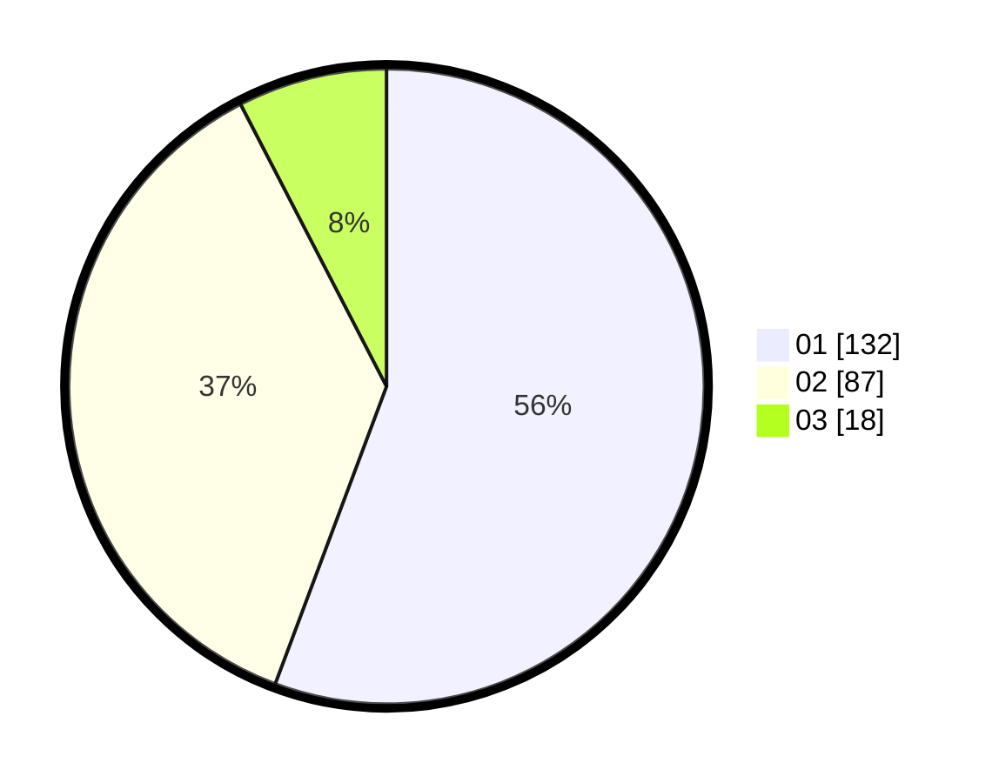

# Hasil

Hasil perolehan suara paslon dapat dilihat pada file paslon-01.txt, paslon-02.txt, dan paslon-03.txt.

Jika tidak ada, artinya data tersebut belum ada pada SIREKAP.

## Perolehan Suara

 * Paslon 01: **132**.
 * Paslon 02: **87**.
 * Paslon 03: **18**.

## Foto C Plano

https://sirekap-obj-formc.kpu.go.id/c284/pemilu/ppwp/31/75/04/10/06/3175041006074-20240215-003833--0640d1f7-cef3-4875-9783-f034f75e6ed5.jpg

https://sirekap-obj-formc.kpu.go.id/c284/pemilu/ppwp/31/75/04/10/06/3175041006074-20240215-003953--f06c0c4b-3562-4cb1-b4dc-1841dce76c4f.jpg

https://sirekap-obj-formc.kpu.go.id/c284/pemilu/ppwp/31/75/04/10/06/3175041006074-20240215-004609--a55b17f7-7229-466a-ac57-b008d372f6cd.jpg
