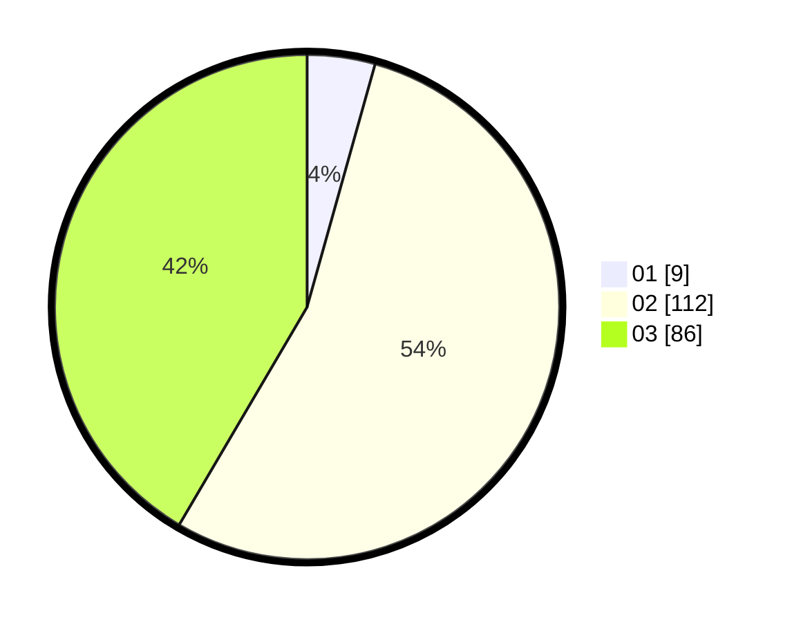

# Hasil

Hasil perolehan suara paslon dapat dilihat pada file paslon-01.txt, paslon-02.txt, dan paslon-03.txt.

Jika tidak ada, artinya data tersebut belum ada pada SIREKAP.

## Perolehan Suara

 * Paslon 01: **9**.
 * Paslon 02: **112**.
 * Paslon 03: **86**.

## Foto C Plano

https://sirekap-obj-formc.kpu.go.id/af50/pemilu/ppwp/31/75/04/10/06/3175041006082-20240214-202855--252e31ec-6cbf-4300-90de-9897f887a88e.jpg

https://sirekap-obj-formc.kpu.go.id/af50/pemilu/ppwp/31/75/04/10/06/3175041006082-20240214-202854--7c266dab-d958-41db-be0b-b512141efa60.jpg
