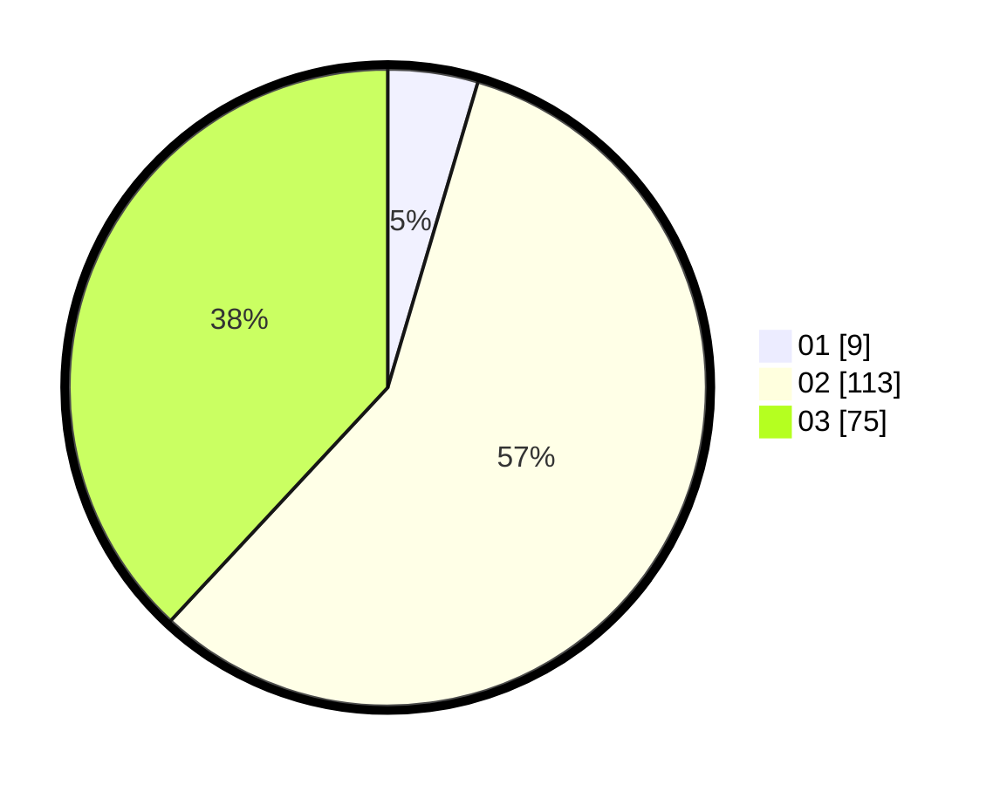

# Hasil

Hasil perolehan suara paslon dapat dilihat pada file paslon-01.txt, paslon-02.txt, dan paslon-03.txt.

Jika tidak ada, artinya data tersebut belum ada pada SIREKAP.

## Perolehan Suara

 * Paslon 01: **9**.
 * Paslon 02: **113**.
 * Paslon 03: **75**.

## Foto C Plano

https://sirekap-obj-formc.kpu.go.id/3e1d/pemilu/ppwp/31/75/04/10/06/3175041006089-20240215-172514--ec3027ca-75d7-4afe-ae47-7a3d4dac586f.jpg

https://sirekap-obj-formc.kpu.go.id/3e1d/pemilu/ppwp/31/75/04/10/06/3175041006089-20240215-172516--1ae2a988-c8a8-4882-a430-8c5512f88546.jpg

https://sirekap-obj-formc.kpu.go.id/3e1d/pemilu/ppwp/31/75/04/10/06/3175041006089-20240215-172515--c960b27d-0154-4308-befd-b2588b1ff39f.jpg

## DATA PEMILIH TETAP

Jumlah pemilih dalam DPT: **265**.
 * L: **120**.
 * P: **145**.

## DATA PENGGUNA HAK PILIH

Jumlah pengguna hak pilih dalam DPT: **193**.
 * L: **85**.
 * P: **108**.

Jumlah pengguna hak pilih dalam DPTb: **0**.
 * L: **0**.
 * P: **0**.

Jumlah pengguna hak pilih dalam DPK: **5**.
 * L: **2**.
 * P: **3**.

Jumlah pengguna hak pilih: **198**.
 * L: **87**.
 * P: **111**.

## JUMLAH SUARA SAH DAN TIDAK SAH

JUMLAH SELURUH SUARA SAH: **197**.

JUMLAH SUARA TIDAK SAH: **1**.

JUMLAH SELURUH SUARA SAH DAN SUARA TIDAK SAH: **198**.
