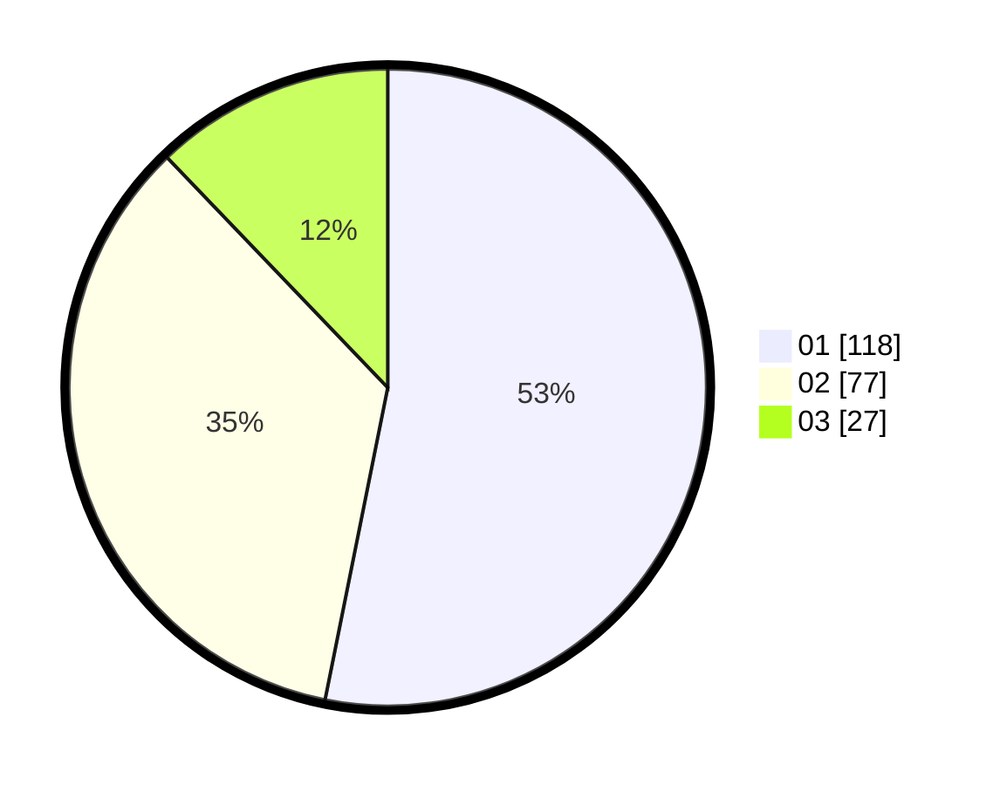

# Hasil

Hasil perolehan suara paslon dapat dilihat pada file paslon-01.txt, paslon-02.txt, dan paslon-03.txt.

Jika tidak ada, artinya data tersebut belum ada pada SIREKAP.

## Perolehan Suara

 * Paslon 01: **118**.
 * Paslon 02: **77**.
 * Paslon 03: **27**.

## Foto C Plano

https://sirekap-obj-formc.kpu.go.id/eb48/pemilu/ppwp/31/75/04/10/06/3175041006095-20240214-155744--693b021f-68ed-4741-b55c-5c0b93179bd0.jpg

https://sirekap-obj-formc.kpu.go.id/eb48/pemilu/ppwp/31/75/04/10/06/3175041006095-20240214-155616--e0cc1909-caff-4588-8310-5c690e24bade.jpg

https://sirekap-obj-formc.kpu.go.id/eb48/pemilu/ppwp/31/75/04/10/06/3175041006095-20240214-212108--32ceefdb-b72d-44ce-b6d9-01d560c08aa0.jpg

## DATA PEMILIH TETAP

Jumlah pemilih dalam DPT: **280**.
 * L: **131**.
 * P: **149**.

## DATA PENGGUNA HAK PILIH

Jumlah pengguna hak pilih dalam DPT: **217**.
 * L: **101**.
 * P: **116**.

Jumlah pengguna hak pilih dalam DPTb: **9**.
 * L: **1**.
 * P: **8**.

Jumlah pengguna hak pilih dalam DPK: **3**.
 * L: **2**.
 * P: **1**.

Jumlah pengguna hak pilih: **229**.
 * L: **104**.
 * P: **125**.

## JUMLAH SUARA SAH DAN TIDAK SAH

JUMLAH SELURUH SUARA SAH: **222**.

JUMLAH SUARA TIDAK SAH: **7**.

JUMLAH SELURUH SUARA SAH DAN SUARA TIDAK SAH: **229**.
