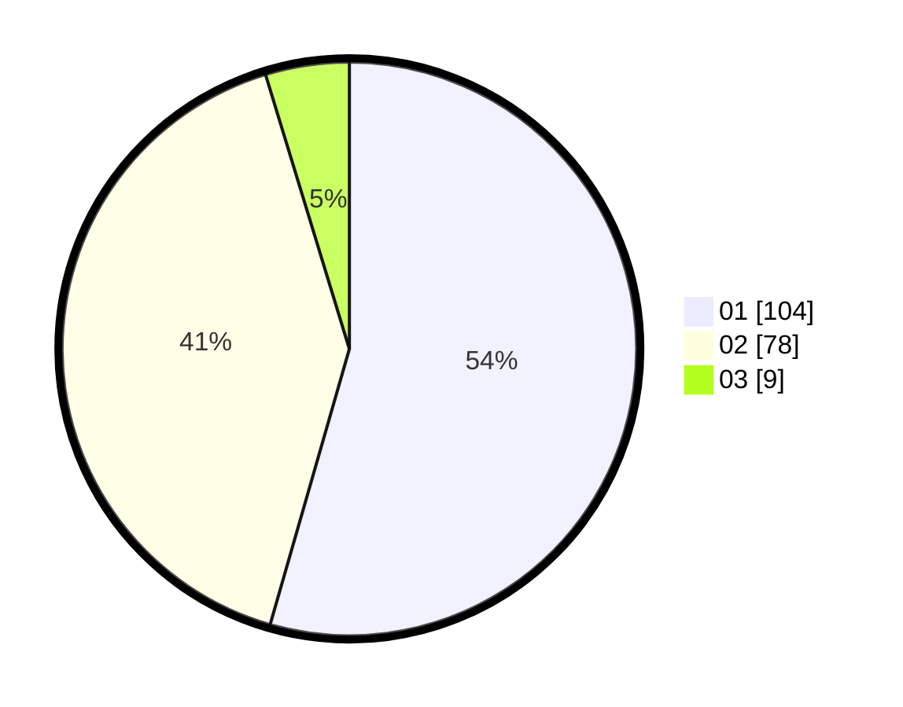

# Hasil

Hasil perolehan suara paslon dapat dilihat pada file paslon-01.txt, paslon-02.txt, dan paslon-03.txt.

Jika tidak ada, artinya data tersebut belum ada pada SIREKAP.

## Perolehan Suara

 * Paslon 01: **104**.
 * Paslon 02: **78**.
 * Paslon 03: **9**.

## Foto C Plano

https://sirekap-obj-formc.kpu.go.id/5a04/pemilu/ppwp/31/75/04/10/06/3175041006100-20240214-191231--d23a9766-0113-4ffb-b0be-927f93d9789a.jpg

https://sirekap-obj-formc.kpu.go.id/5a04/pemilu/ppwp/31/75/04/10/06/3175041006100-20240214-194854--c827807a-3ebe-40a9-95d8-2e3a377e94ce.jpg

https://sirekap-obj-formc.kpu.go.id/5a04/pemilu/ppwp/31/75/04/10/06/3175041006100-20240214-191831--cbbb8d5b-cfc6-4350-ad27-c95d9ab7df81.jpg

## DATA PEMILIH TETAP

Jumlah pemilih dalam DPT: **262**.
 * L: **119**.
 * P: **143**.

## DATA PENGGUNA HAK PILIH

Jumlah pengguna hak pilih dalam DPT: **187**.
 * L: **76**.
 * P: **111**.

Jumlah pengguna hak pilih dalam DPTb: **6**.
 * L: **2**.
 * P: **4**.

Jumlah pengguna hak pilih dalam DPK: **2**.
 * L: **2**.
 * P: **0**.

Jumlah pengguna hak pilih: **195**.
 * L: **80**.
 * P: **115**.

## JUMLAH SUARA SAH DAN TIDAK SAH

JUMLAH SELURUH SUARA SAH: **191**.

JUMLAH SUARA TIDAK SAH: **4**.

JUMLAH SELURUH SUARA SAH DAN SUARA TIDAK SAH: **195**.
