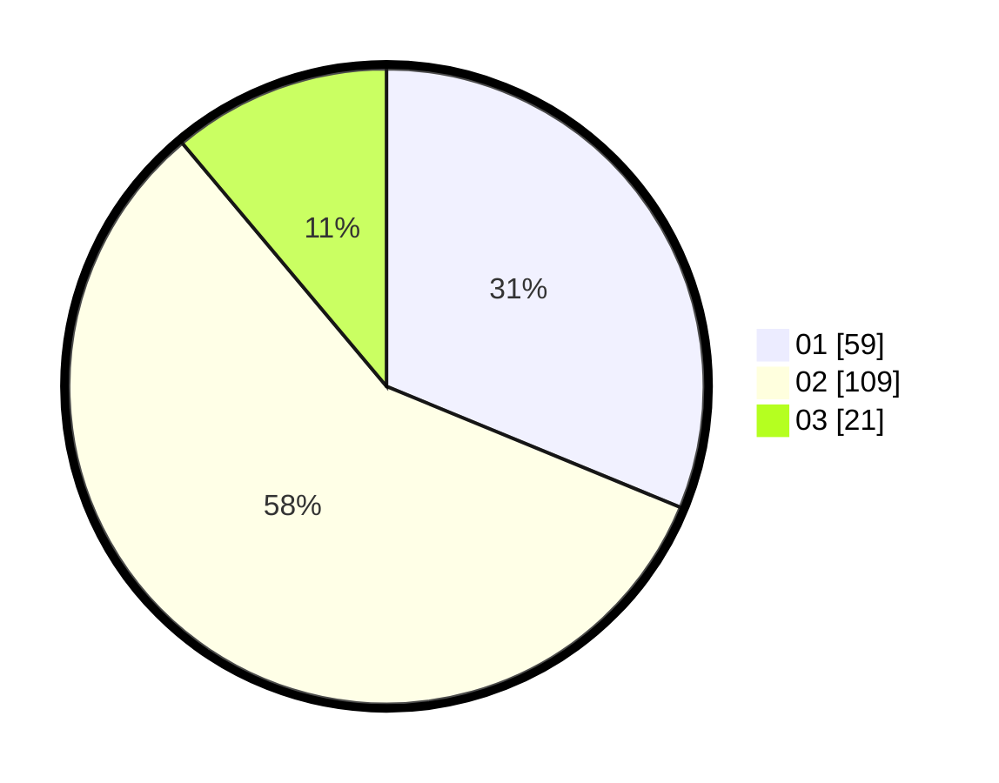

# Hasil

Hasil perolehan suara paslon dapat dilihat pada file paslon-01.txt, paslon-02.txt, dan paslon-03.txt.

Jika tidak ada, artinya data tersebut belum ada pada SIREKAP.

## Perolehan Suara

 * Paslon 01: **59**.
 * Paslon 02: **109**.
 * Paslon 03: **21**.

## Foto C Plano

https://sirekap-obj-formc.kpu.go.id/4f19/pemilu/ppwp/31/75/04/10/06/3175041006106-20240214-205741--af01826b-a6ae-403b-a20f-d16eaff423a2.jpg

https://sirekap-obj-formc.kpu.go.id/4f19/pemilu/ppwp/31/75/04/10/06/3175041006106-20240214-210042--d1154eb8-76fd-4776-bc56-a9ca8ae6279b.jpg

https://sirekap-obj-formc.kpu.go.id/4f19/pemilu/ppwp/31/75/04/10/06/3175041006106-20240214-210247--573df4dc-8db4-49e0-bc4d-71eca88eaba2.jpg
