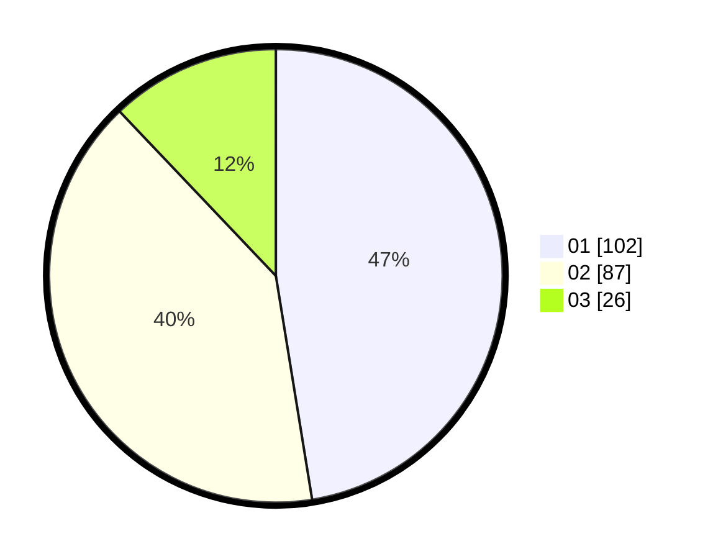

# Hasil

Hasil perolehan suara paslon dapat dilihat pada file paslon-01.txt, paslon-02.txt, dan paslon-03.txt.

Jika tidak ada, artinya data tersebut belum ada pada SIREKAP.

## Perolehan Suara

 * Paslon 01: **102**.
 * Paslon 02: **87**.
 * Paslon 03: **26**.

## Foto C Plano

https://sirekap-obj-formc.kpu.go.id/77e2/pemilu/ppwp/31/75/04/10/06/3175041006112-20240214-210508--230812b0-7d75-4259-9358-59fb791b43c1.jpg

https://sirekap-obj-formc.kpu.go.id/77e2/pemilu/ppwp/31/75/04/10/06/3175041006112-20240214-222144--1c22d370-09a6-46fb-b4ba-3827511e7e3b.jpg

https://sirekap-obj-formc.kpu.go.id/77e2/pemilu/ppwp/31/75/04/10/06/3175041006112-20240214-210926--cb081724-754f-472c-8fa4-db659d2db0de.jpg
