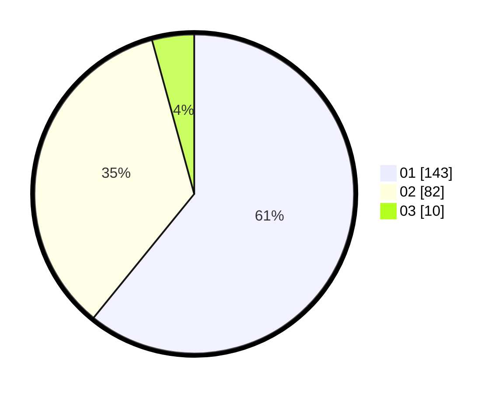

# Hasil

Hasil perolehan suara paslon dapat dilihat pada file paslon-01.txt, paslon-02.txt, dan paslon-03.txt.

Jika tidak ada, artinya data tersebut belum ada pada SIREKAP.

## Perolehan Suara

 * Paslon 01: **143**.
 * Paslon 02: **82**.
 * Paslon 03: **10**.

## Foto C Plano

https://sirekap-obj-formc.kpu.go.id/22c9/pemilu/ppwp/31/75/04/10/06/3175041006115-20240214-193628--5446e547-4933-4cdb-9a84-99f401458e64.jpg

https://sirekap-obj-formc.kpu.go.id/22c9/pemilu/ppwp/31/75/04/10/06/3175041006115-20240214-191223--f8831a89-9aab-4cdb-85f0-9a57bc4fdb09.jpg

https://sirekap-obj-formc.kpu.go.id/22c9/pemilu/ppwp/31/75/04/10/06/3175041006115-20240214-193517--629c9d2a-7ced-4049-846f-ebafa2441199.jpg
