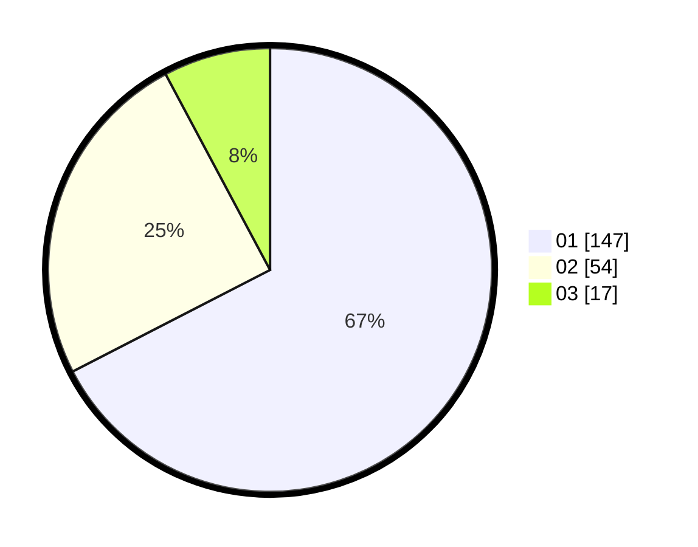

# Hasil

Hasil perolehan suara paslon dapat dilihat pada file paslon-01.txt, paslon-02.txt, dan paslon-03.txt.

Jika tidak ada, artinya data tersebut belum ada pada SIREKAP.

## Perolehan Suara

 * Paslon 01: **147**.
 * Paslon 02: **54**.
 * Paslon 03: **17**.

## Foto C Plano

https://sirekap-obj-formc.kpu.go.id/c00d/pemilu/ppwp/31/75/04/10/06/3175041006117-20240214-220927--07e13114-80db-4932-b1df-c2069c341382.jpg

https://sirekap-obj-formc.kpu.go.id/c00d/pemilu/ppwp/31/75/04/10/06/3175041006117-20240214-220936--121c2fae-2199-4122-8895-60dde10a78e6.jpg

https://sirekap-obj-formc.kpu.go.id/c00d/pemilu/ppwp/31/75/04/10/06/3175041006117-20240214-220921--f0587d04-a07e-4630-8b11-7954f8218412.jpg
