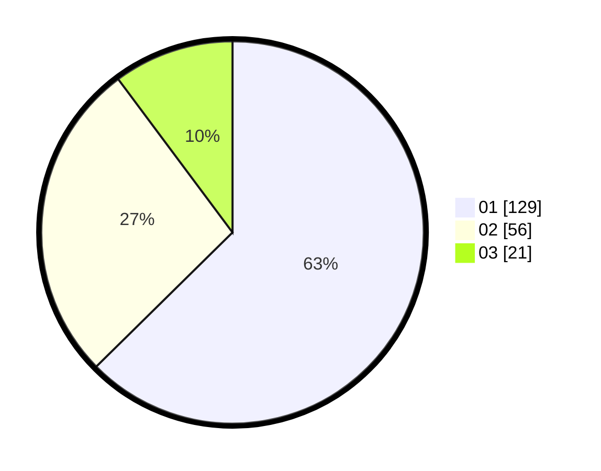

# Hasil

Hasil perolehan suara paslon dapat dilihat pada file paslon-01.txt, paslon-02.txt, dan paslon-03.txt.

Jika tidak ada, artinya data tersebut belum ada pada SIREKAP.

## Perolehan Suara

 * Paslon 01: **129**.
 * Paslon 02: **56**.
 * Paslon 03: **21**.

## Foto C Plano

https://sirekap-obj-formc.kpu.go.id/16bc/pemilu/ppwp/31/75/04/10/06/3175041006119-20240214-235339--00ebb52d-491c-4c55-adf3-21c7d9e644a8.jpg

https://sirekap-obj-formc.kpu.go.id/16bc/pemilu/ppwp/31/75/04/10/06/3175041006119-20240214-235444--6ce1c5cf-4d1e-40f0-8a5e-2dbbd622e4e5.jpg

https://sirekap-obj-formc.kpu.go.id/16bc/pemilu/ppwp/31/75/04/10/06/3175041006119-20240214-235537--60b1881f-8a2f-4e60-9282-85c15e1e1291.jpg
