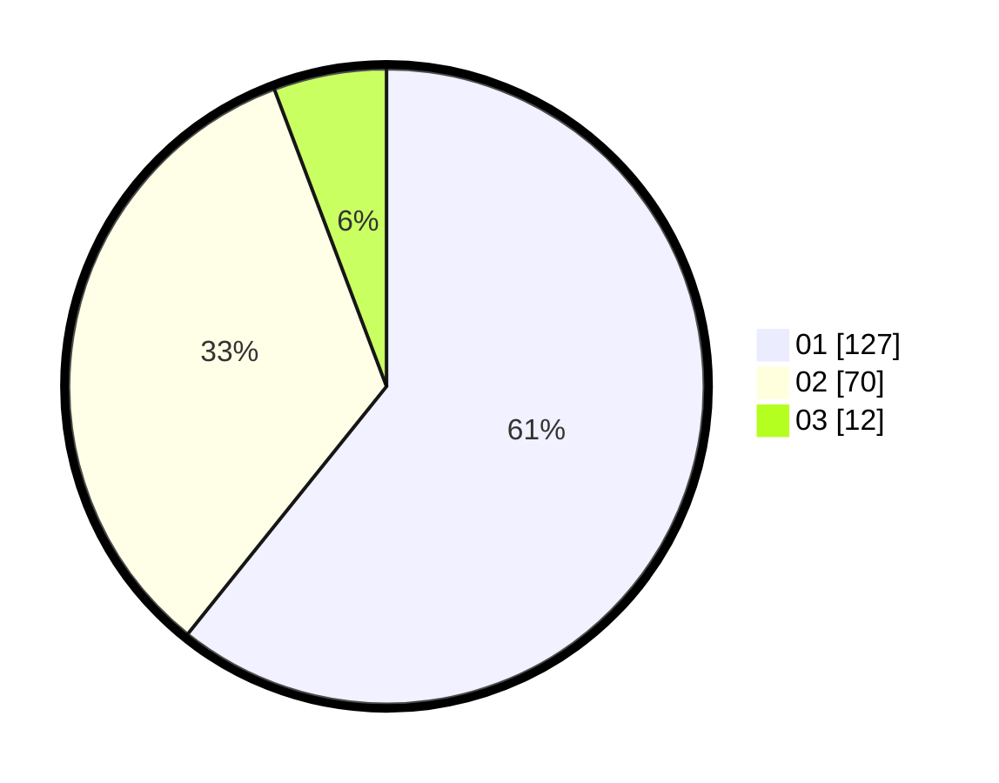

# Hasil

Hasil perolehan suara paslon dapat dilihat pada file paslon-01.txt, paslon-02.txt, dan paslon-03.txt.

Jika tidak ada, artinya data tersebut belum ada pada SIREKAP.

## Perolehan Suara

 * Paslon 01: **127**.
 * Paslon 02: **70**.
 * Paslon 03: **12**.

## Foto C Plano

https://sirekap-obj-formc.kpu.go.id/c2d1/pemilu/ppwp/31/75/04/10/06/3175041006132-20240214-155327--c839348a-41a2-4514-93d6-748647b0ddae.jpg

https://sirekap-obj-formc.kpu.go.id/c2d1/pemilu/ppwp/31/75/04/10/06/3175041006132-20240214-160059--ff4e2c17-0c23-4235-9409-a7909aa9094a.jpg

https://sirekap-obj-formc.kpu.go.id/c2d1/pemilu/ppwp/31/75/04/10/06/3175041006132-20240214-191119--a2ca1728-5fac-4d39-8dea-9960b8d4178e.jpg

## DATA PEMILIH TETAP

Jumlah pemilih dalam DPT: **265**.
 * L: **127**.
 * P: **138**.

## DATA PENGGUNA HAK PILIH

Jumlah pengguna hak pilih dalam DPT: **208**.
 * L: **95**.
 * P: **113**.

Jumlah pengguna hak pilih dalam DPTb: **0**.
 * L: **0**.
 * P: **0**.

Jumlah pengguna hak pilih dalam DPK: **2**.
 * L: **1**.
 * P: **1**.

Jumlah pengguna hak pilih: **210**.
 * L: **96**.
 * P: **114**.

## JUMLAH SUARA SAH DAN TIDAK SAH

JUMLAH SELURUH SUARA SAH: **209**.

JUMLAH SUARA TIDAK SAH: **1**.

JUMLAH SELURUH SUARA SAH DAN SUARA TIDAK SAH: **210**.
