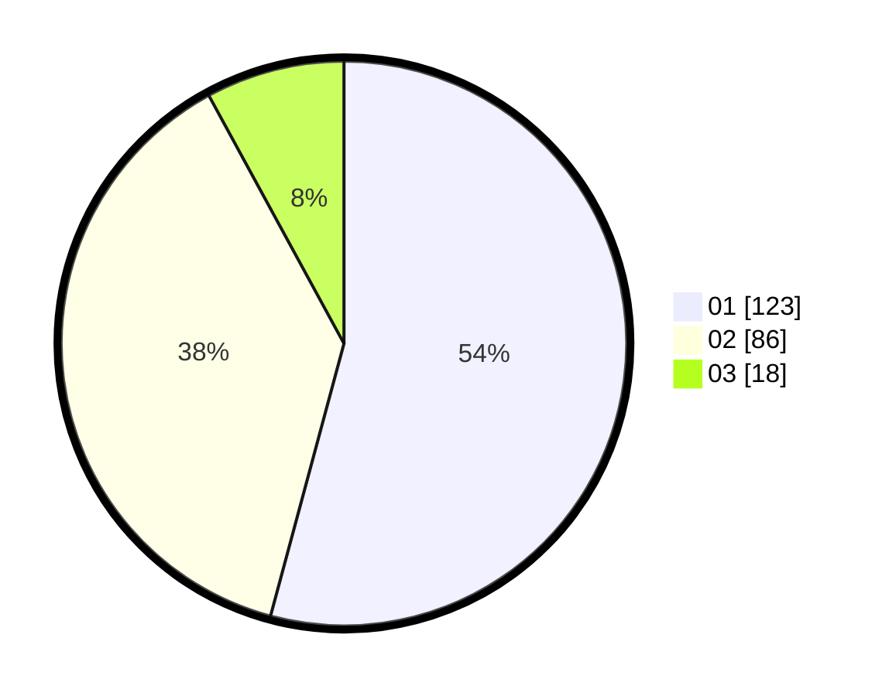

# Hasil

Hasil perolehan suara paslon dapat dilihat pada file paslon-01.txt, paslon-02.txt, dan paslon-03.txt.

Jika tidak ada, artinya data tersebut belum ada pada SIREKAP.

## Perolehan Suara

 * Paslon 01: **123**.
 * Paslon 02: **86**.
 * Paslon 03: **18**.

## Foto C Plano

https://sirekap-obj-formc.kpu.go.id/fb6d/pemilu/ppwp/31/75/04/10/06/3175041006134-20240214-214407--de4489d6-c331-4efe-985e-496b40d9335c.jpg

https://sirekap-obj-formc.kpu.go.id/fb6d/pemilu/ppwp/31/75/04/10/06/3175041006134-20240214-214549--214be5b8-86e7-405c-b4b0-db6480932562.jpg

https://sirekap-obj-formc.kpu.go.id/fb6d/pemilu/ppwp/31/75/04/10/06/3175041006134-20240214-214852--75ca2fa1-e942-48e9-8e10-056ce8dd7ee5.jpg
