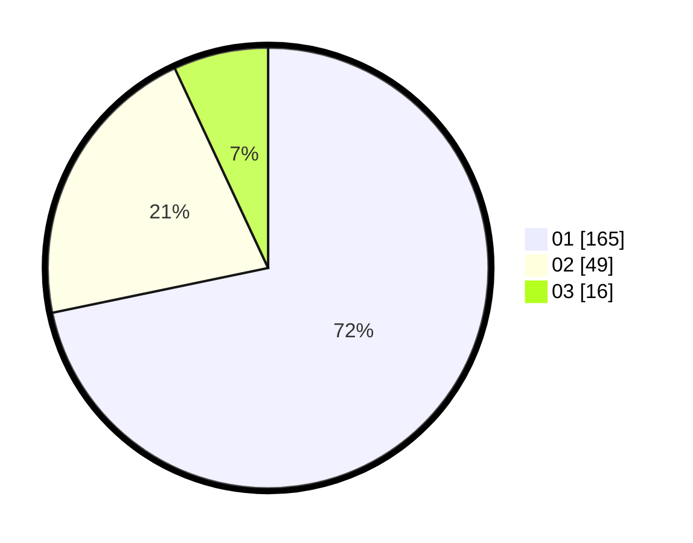

# Hasil

Hasil perolehan suara paslon dapat dilihat pada file paslon-01.txt, paslon-02.txt, dan paslon-03.txt.

Jika tidak ada, artinya data tersebut belum ada pada SIREKAP.

## Perolehan Suara

 * Paslon 01: **165**.
 * Paslon 02: **49**.
 * Paslon 03: **16**.

## Foto C Plano

https://sirekap-obj-formc.kpu.go.id/9c6d/pemilu/ppwp/31/75/04/10/06/3175041006136-20240214-235637--dda5ffc7-4a4d-4128-bdbd-2ca29b11afc8.jpg

https://sirekap-obj-formc.kpu.go.id/9c6d/pemilu/ppwp/31/75/04/10/06/3175041006136-20240215-000005--b79e325e-9ce8-44af-811f-ebd4b9a6993e.jpg
