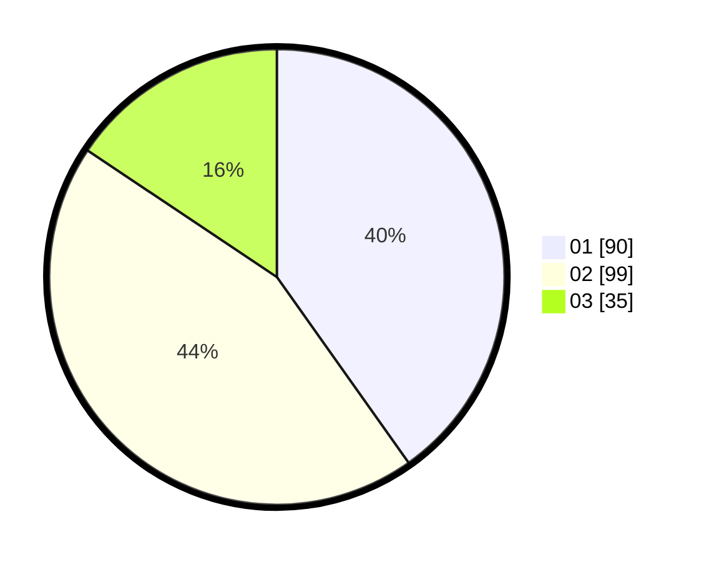

# Hasil

Hasil perolehan suara paslon dapat dilihat pada file paslon-01.txt, paslon-02.txt, dan paslon-03.txt.

Jika tidak ada, artinya data tersebut belum ada pada SIREKAP.

## Perolehan Suara

 * Paslon 01: **90**.
 * Paslon 02: **99**.
 * Paslon 03: **35**.

## Foto C Plano

https://sirekap-obj-formc.kpu.go.id/7ce1/pemilu/ppwp/31/75/04/10/07/3175041007015-20240217-110208--07eef942-d812-44a4-979a-6fc1199e5a72.jpg

https://sirekap-obj-formc.kpu.go.id/7ce1/pemilu/ppwp/31/75/04/10/07/3175041007015-20240217-112927--1689ae2f-88f0-46cb-9389-dc864a1f1e9e.jpg

https://sirekap-obj-formc.kpu.go.id/7ce1/pemilu/ppwp/31/75/04/10/07/3175041007015-20240217-110556--cf5ab607-7522-4734-b2e4-bf389a86093c.jpg

## DATA PEMILIH TETAP

Jumlah pemilih dalam DPT: **287**.
 * L: **143**.
 * P: **144**.

## DATA PENGGUNA HAK PILIH

Jumlah pengguna hak pilih dalam DPT: **110**.
 * L: **104**.
 * P: **106**.

Jumlah pengguna hak pilih dalam DPTb: **11**.
 * L: **5**.
 * P: **6**.

Jumlah pengguna hak pilih dalam DPK: **5**.
 * L: **2**.
 * P: **3**.

Jumlah pengguna hak pilih: **226**.
 * L: **111**.
 * P: **115**.

## JUMLAH SUARA SAH DAN TIDAK SAH

JUMLAH SELURUH SUARA SAH: **224**.

JUMLAH SUARA TIDAK SAH: **2**.

JUMLAH SELURUH SUARA SAH DAN SUARA TIDAK SAH: **226**.
