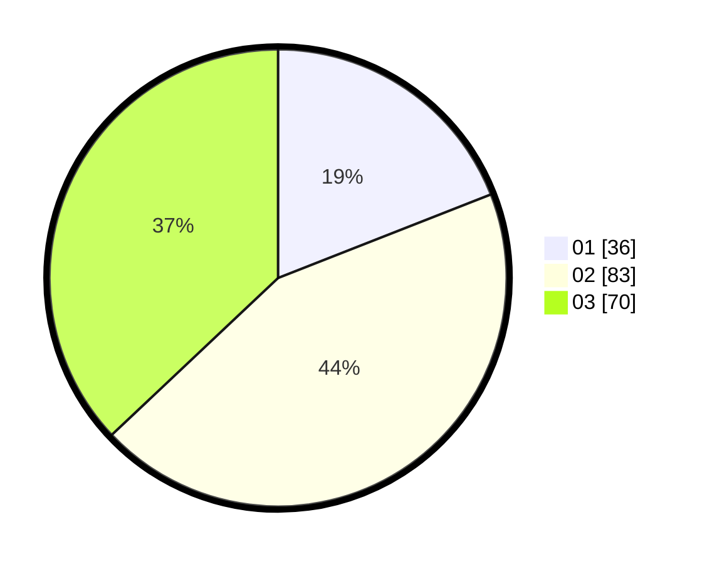

# Hasil

Hasil perolehan suara paslon dapat dilihat pada file paslon-01.txt, paslon-02.txt, dan paslon-03.txt.

Jika tidak ada, artinya data tersebut belum ada pada SIREKAP.

## Perolehan Suara

 * Paslon 01: **36**.
 * Paslon 02: **83**.
 * Paslon 03: **70**.

## Foto C Plano

https://sirekap-obj-formc.kpu.go.id/81e9/pemilu/ppwp/31/75/04/10/07/3175041007020-20240215-011946--fec86daa-fb30-4ef2-ae99-19f4d730b9aa.jpg

https://sirekap-obj-formc.kpu.go.id/81e9/pemilu/ppwp/31/75/04/10/07/3175041007020-20240215-012104--a8f55231-2b66-41a7-be1b-ad07aa2ba81e.jpg

https://sirekap-obj-formc.kpu.go.id/81e9/pemilu/ppwp/31/75/04/10/07/3175041007020-20240215-012144--ec675f6c-5687-47dc-98c9-146f77f7d834.jpg

## DATA PEMILIH TETAP

Jumlah pemilih dalam DPT: **262**.
 * L: **128**.
 * P: **134**.

## DATA PENGGUNA HAK PILIH

Jumlah pengguna hak pilih dalam DPT: **187**.
 * L: **79**.
 * P: **108**.

Jumlah pengguna hak pilih dalam DPTb: **3**.
 * L: **2**.
 * P: **1**.

Jumlah pengguna hak pilih dalam DPK: **1**.
 * L: **1**.
 * P: **0**.

Jumlah pengguna hak pilih: **191**.
 * L: **82**.
 * P: **109**.

## JUMLAH SUARA SAH DAN TIDAK SAH

JUMLAH SELURUH SUARA SAH: **189**.

JUMLAH SUARA TIDAK SAH: **2**.

JUMLAH SELURUH SUARA SAH DAN SUARA TIDAK SAH: **191**.
