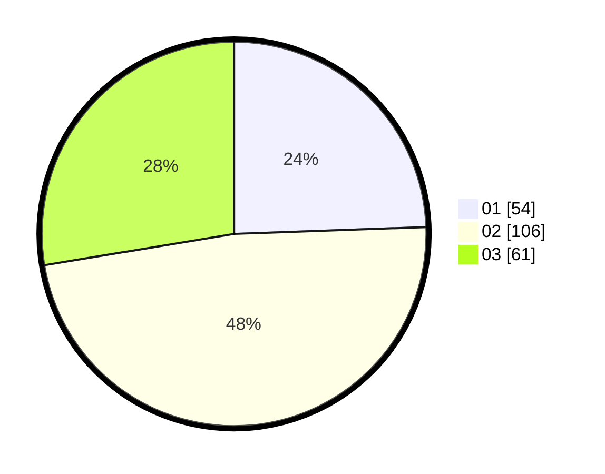

# Hasil

Hasil perolehan suara paslon dapat dilihat pada file paslon-01.txt, paslon-02.txt, dan paslon-03.txt.

Jika tidak ada, artinya data tersebut belum ada pada SIREKAP.

## Perolehan Suara

 * Paslon 01: **54**.
 * Paslon 02: **106**.
 * Paslon 03: **61**.

## Foto C Plano

https://sirekap-obj-formc.kpu.go.id/46fb/pemilu/ppwp/31/75/04/10/07/3175041007021-20240217-005838--c5127e83-96d5-48a3-8f84-e8fef7b3a532.jpg

https://sirekap-obj-formc.kpu.go.id/46fb/pemilu/ppwp/31/75/04/10/07/3175041007021-20240217-005553--1453b9ec-70d5-4707-af64-511cb3cd9c3d.jpg

https://sirekap-obj-formc.kpu.go.id/46fb/pemilu/ppwp/31/75/04/10/07/3175041007021-20240217-005709--e8061b87-0c63-4b63-9a40-6cfbf70a2aa7.jpg
