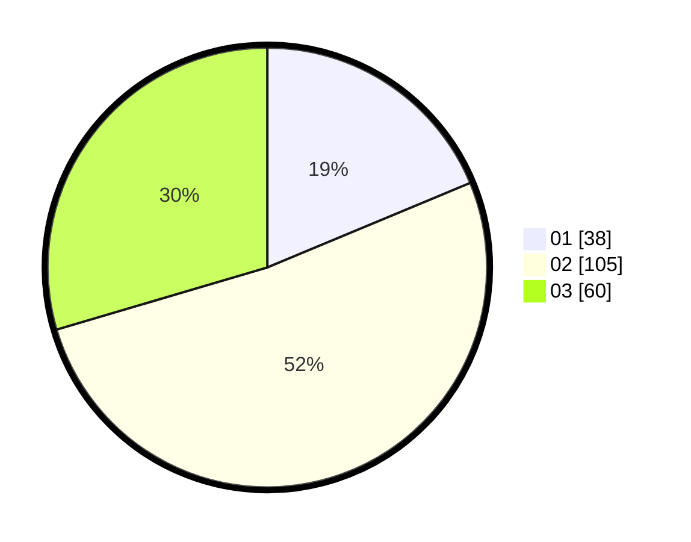

# Hasil

Hasil perolehan suara paslon dapat dilihat pada file paslon-01.txt, paslon-02.txt, dan paslon-03.txt.

Jika tidak ada, artinya data tersebut belum ada pada SIREKAP.

## Perolehan Suara

 * Paslon 01: **38**.
 * Paslon 02: **105**.
 * Paslon 03: **60**.

## Foto C Plano

https://sirekap-obj-formc.kpu.go.id/e040/pemilu/ppwp/31/75/04/10/07/3175041007022-20240218-221335--64608173-b817-4b7e-9433-edf5e164f635.jpg

https://sirekap-obj-formc.kpu.go.id/e040/pemilu/ppwp/31/75/04/10/07/3175041007022-20240218-221355--6bc30d2c-43ac-4ce8-83e1-96679f41057f.jpg

https://sirekap-obj-formc.kpu.go.id/e040/pemilu/ppwp/31/75/04/10/07/3175041007022-20240218-221506--1d85ebc2-5fe8-4ec2-8bd2-8e3e68466701.jpg
