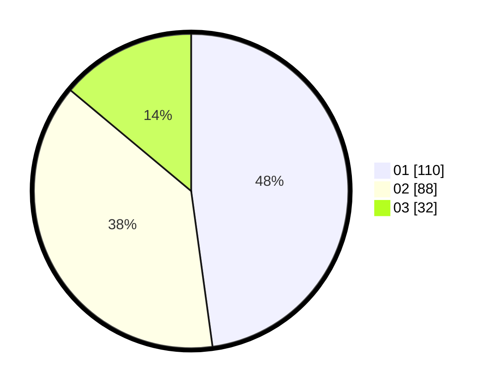

# Hasil

Hasil perolehan suara paslon dapat dilihat pada file paslon-01.txt, paslon-02.txt, dan paslon-03.txt.

Jika tidak ada, artinya data tersebut belum ada pada SIREKAP.

## Perolehan Suara

 * Paslon 01: **110**.
 * Paslon 02: **88**.
 * Paslon 03: **32**.

## Foto C Plano

https://sirekap-obj-formc.kpu.go.id/5d6e/pemilu/ppwp/31/75/04/10/07/3175041007028-20240214-213731--70856cee-388d-46d2-a1ac-35a8e679eb77.jpg

https://sirekap-obj-formc.kpu.go.id/5d6e/pemilu/ppwp/31/75/04/10/07/3175041007028-20240214-213917--48d5b187-8612-4bb5-840f-50f58ed9e240.jpg

https://sirekap-obj-formc.kpu.go.id/5d6e/pemilu/ppwp/31/75/04/10/07/3175041007028-20240214-214011--88a4f64c-ac77-40b0-a4eb-73338c42985a.jpg
