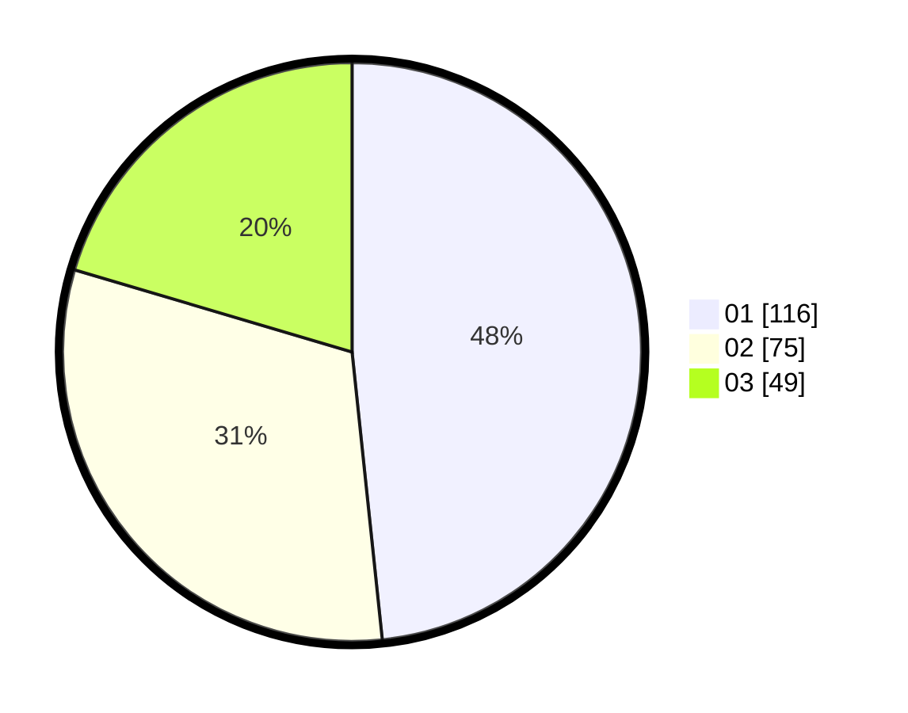

# Hasil

Hasil perolehan suara paslon dapat dilihat pada file paslon-01.txt, paslon-02.txt, dan paslon-03.txt.

Jika tidak ada, artinya data tersebut belum ada pada SIREKAP.

## Perolehan Suara

 * Paslon 01: **116**.
 * Paslon 02: **75**.
 * Paslon 03: **49**.

## Foto C Plano

https://sirekap-obj-formc.kpu.go.id/7ce6/pemilu/ppwp/31/75/04/10/07/3175041007030-20240216-021342--b7796fab-afb3-4f88-988b-ff3a028d8ef1.jpg

https://sirekap-obj-formc.kpu.go.id/7ce6/pemilu/ppwp/31/75/04/10/07/3175041007030-20240216-021352--fefcb724-9040-4e9e-abb2-b2620149f6a5.jpg

https://sirekap-obj-formc.kpu.go.id/7ce6/pemilu/ppwp/31/75/04/10/07/3175041007030-20240216-021347--d59128f3-2162-4843-81d8-f95b76280035.jpg

## DATA PEMILIH TETAP

Jumlah pemilih dalam DPT: **286**.
 * L: **142**.
 * P: **144**.

## DATA PENGGUNA HAK PILIH

Jumlah pengguna hak pilih dalam DPT: **235**.
 * L: **113**.
 * P: **122**.

Jumlah pengguna hak pilih dalam DPTb: **4**.
 * L: **0**.
 * P: **4**.

Jumlah pengguna hak pilih dalam DPK: **2**.
 * L: **2**.
 * P: **0**.

Jumlah pengguna hak pilih: **241**.
 * L: **115**.
 * P: **126**.

## JUMLAH SUARA SAH DAN TIDAK SAH

JUMLAH SELURUH SUARA SAH: **240**.

JUMLAH SUARA TIDAK SAH: **1**.

JUMLAH SELURUH SUARA SAH DAN SUARA TIDAK SAH: **241**.
