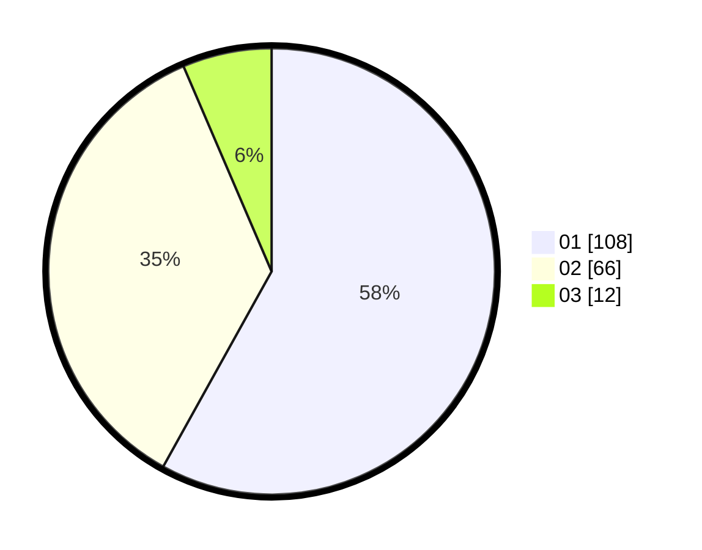

# Hasil

Hasil perolehan suara paslon dapat dilihat pada file paslon-01.txt, paslon-02.txt, dan paslon-03.txt.

Jika tidak ada, artinya data tersebut belum ada pada SIREKAP.

## Perolehan Suara

 * Paslon 01: **108**.
 * Paslon 02: **66**.
 * Paslon 03: **12**.

## Foto C Plano

https://sirekap-obj-formc.kpu.go.id/daad/pemilu/ppwp/31/75/04/10/07/3175041007034-20240214-155917--ccef7ed3-a021-4808-aabd-906153bdc9c3.jpg

https://sirekap-obj-formc.kpu.go.id/daad/pemilu/ppwp/31/75/04/10/07/3175041007034-20240214-155425--f8462be4-9b23-4fad-822a-49738d49a5ad.jpg

https://sirekap-obj-formc.kpu.go.id/daad/pemilu/ppwp/31/75/04/10/07/3175041007034-20240214-155616--8adb10be-467a-47d4-82fb-93f8590127ca.jpg
